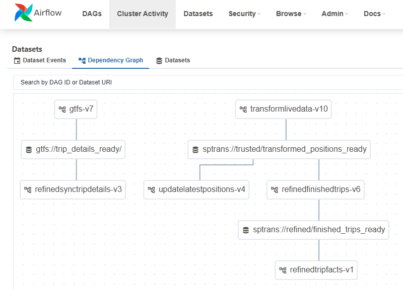

This project provides its users with visualizations of the current positions of all buses tracked by SPTrans and presents information about the trips completed in the last few hours.

To achieve this, Sptransinsights extracts the positions of all buses in circulation at regular intervals, stores this data, and generates information about each vehicle’s trips on each route. This allows users to gain insights and identify better times to travel.

A complete data quality framework, with configuration-driven validations using JSON Schema and Great Expectations, quarantine of invalid records, and generation of quality reports with both summary and processing details for observability, is applied to the most critical pipelines.

Quality summaries from the main pipelines and from the ingestion microservice are sent via webhook to an alert-generation microservice, which is responsible for sending email notifications with immediate alerts for failures and cumulative alerts for warnings.

The solution adopts a monorepo structure and is composed of several subprojects. Each one has its own README with information about its role and operational requirements.

## Architecture

The project’s main design decisions, chosen technologies, rejected alternatives, and accepted tradeoffs are documented as Architecture Decision Records in `docs/adr_EN/`. The ADRs cover topics ranging from the choice of Medallion Architecture and DuckDB as the transformation engine to the durable PostgreSQL queue design, the multi-layer data quality framework, the `alertservice` design, and the pipeline promotion workflow.

[ADR index](./docs/adr_EN/README-EN.md)


The following components were adopted to implement the solution:
- Docker and Docker Compose: used to package and run the solution components in containers, and to orchestrate local environment startup with services such as Airflow, PostgreSQL, MinIO, Jupyter, `extractloadlivedata`, and `alertservice`, reducing manual setup effort and increasing environment reproducibility.
- [extractloadlivedata](./extractloadlivedata/README-EN.md): microservice that extracts data from the SPTrans API at regular intervals, initially every 2 minutes, while allowing this interval to be reduced, which would not be feasible with an Airflow job because execution delays would compromise interval precision. It saves data first to a local volume and then to the raw layer implemented with MinIO.
- [alertservice](./alertservice/README-EN.md): microservice that receives quality summaries via webhook from the ingest microservice and the pipelines, and sends email notifications with immediate failure alerts and cumulative warning alerts based on per-pipeline thresholds.
- MinIO: used to implement the raw layer for storing raw data extracted from the SPTrans API and GTFS data, and also the trusted layer for transformed data with quality checks applied.
- DuckDB: used in transformation processes to run SQL queries directly on Parquet tables stored in the trusted layer implemented through MinIO, with excellent performance and without requiring SQL engines such as Presto, therefore reducing infrastructure complexity. It is also used for exploratory analysis through Jupyter.
- [Jupyter](./jupyter/README-EN.md): used to create notebooks for exploratory data analysis over the trusted layer stored in object storage.
- PostgreSQL: used to store the refined layer, enabling low-latency queries for the visualization layer.
- [Power BI](./powerbi/README-EN.md): used to implement the visualization layer because of its flexibility, power, and wide adoption, consuming data directly from the refined layer through PostgreSQL DirectQuery.
- [Airflow](./airflow/README-EN.md): used for orchestration of recurring pipeline processes through multiple DAGs using Python Operator. The production environment for this module is in the `airflow` folder.

The development environment is located in [dags-dev](./dags-dev/README-EN.md).

Details about the DAGs:
- [DAG gtfs](./dags-dev/gtfs/README-EN.md): process composed of three main stages, with quality checks throughout the flow, generation of one consolidated report per execution, and publication of an Airflow Dataset at the end of a successful execution to trigger downstream synchronization into the refined layer.
  - extract and load files: extracts GTFS data from SPTrans, validates the files, and saves them to the raw layer, generating consolidated diagnostics in case of failure
  - transformation: converts base GTFS tables to Parquet, applies quality checks with Great Expectations when configured, uses staging before promotion to the final path, and quarantines artifacts on failure
  - enrichment: creates the `trip_details` table in staging, validates its quality, and either promotes or quarantines the artifact based on the result
- [DAG transformlivedata](./dags-dev/transformlivedata/README-EN.md): transforms raw position data from the raw layer into enriched and trusted data in the trusted layer, with quarantine of invalid records and generation of a consolidated quality report.
  - main configurable artifacts:
  - JSON Schema for structural validation of raw data
  - Great Expectations suite for post-transformation validation
- [DAG orchestratetransform](./dags-dev/orchestratetransform/README-EN.md): identifies bus position data pending processing and triggers the transformation DAG.
- [DAG refinedfinishedtrips](./dags-dev/refinedfinishedtrips/README-EN.md): transforms trusted enriched data into completed trips in the refined layer, with quality checks over positions, extraction, and persistence, plus consolidated reporting and webhook notification.
  - Since version 6 of this pipeline, the Airflow DAG no longer depends on a cron schedule and is instead triggered by an Airflow Dataset emitted by the `transformlivedata` pipeline. This maximizes freshness of the completed trips calculated in the refined layer, updating them immediately after successful publication of transformed data, and simplifies maintenance by removing coupling between upstream and downstream cron schedules.
- [DAG refinedsynctripdetails](./dags-dev/refinedsynctripdetails/README-EN.md): loads canonical trip details from the trusted layer into the refined layer, with light adaptation for the visualization layer, especially for circular routes. This DAG starts as soon as `gtfs` finishes successfully through Airflow Datasets.
- [DAG updatelatestpositions](./dags-dev/updatelatestpositions/README-EN.md): transforms trusted data into latest-position data for each bus in the refined layer. Since version 4 of this pipeline, the Airflow DAG no longer depends on a cron schedule and is instead triggered by an Airflow Dataset emitted by `transformlivedata`, maximizing freshness of `refined.latest_positions`, which is updated immediately after successful publication of transformed data, and simplifying maintenance by removing coupling between upstream and downstream cron schedules.

### Event-driven orchestration in Airflow

The diagram below complements the DAG descriptions by showing the event-driven orchestration currently implemented in Airflow through Datasets.



- `gtfs` publishes the Dataset `gtfs://trip_details_ready`
- `refinedsynctripdetails` is triggered by that Dataset, which means it runs automatically after successful completion of the `gtfs` pipeline
- `transformlivedata` publishes the Dataset `sptrans://trusted/transformed_positions_ready`
- `refinedfinishedtrips` and `updatelatestpositions` are triggered by that Dataset, which means they run automatically after successful completion of the `transformlivedata` pipeline

## Configuration

A configuration template is available in `.env.example` at the project root. This file contains all environment variables required for the infrastructure to work, including MinIO, Airflow, `alertservice`, and `extractloadlivedata`.

## Running Sptransinsights

After starting the project following the instructions below, you must then execute the initialization commands documented in each subproject, especially:
- [Airflow](./airflow/README-EN.md)
- [gtfs](./dags-dev/gtfs/README-EN.md)
- [transformlivedata](./dags-dev/transformlivedata/README-EN.md)
- [refinedfinishedtrips](./dags-dev/refinedfinishedtrips/README-EN.md)
- [updatelatestpositions](./dags-dev/updatelatestpositions/README-EN.md)
- [extractloadlivedata](./extractloadlivedata/README-EN.md)
- [alertservice](./alertservice/README-EN.md)

To start the project:
Create `.env` at the project root based on `.env.example` and fill in all required fields:

```bash
cp .env.example .env
# Edit .env and provide the required credentials
```

Run:

```bash
docker compose up -d
```

If you want to start only specific services:

```shell
docker compose up -d minio
docker compose up -d postgres
docker compose up -d postgres_airflow airflow_webserver airflow_scheduler
docker compose up -d extractloadlivedata
docker compose up -d alertservice
docker compose up -d jupyter
```

## Monitoring and configuration access

MinIO:
`http://localhost:9001/login`

Airflow:
`http://localhost:8080/`

Jupyter:
`http://localhost:8888/`

## Unified pipeline configuration

To standardize configuration across pipelines and environments, the project uses the `pipeline_configurator` module, located in `dags-dev/pipeline_configurator` and promoted to `airflow/dags/pipeline_configurator`.
It provides a single entry point for loading configurations and connections, with structured validation through Pydantic schemas specific to each pipeline.

Output pattern, canonical contract:
- `general`: functional pipeline parameters, such as buckets, tables, folders, and analysis windows
- `connections`: credentials and endpoints, such as `object_storage`, `database`, and `http`
- `raw_data_json_schema`: schema used to validate the JSON format of data coming from API ingestion, when applicable
- `data_expectations`: expectation suite used for pipeline quality checks, when applicable

The module automatically resolves the execution environment:
- **Local/dev**: loads local JSON configuration files and local `.env`
- **Airflow**: uses Airflow Variables and Airflow Connections

This pattern reduces coupling between services and guarantees consistency across all pipelines.

[More information about pipeline configurator](./dags-dev/pipeline_configurator/README-EN.md)

## Development and deployment cycle

To preserve production-environment stability, the project adopts a promotion-based development flow. For pipelines, all code is developed and tested in the `dags-dev` directory and, once validated, is promoted to Airflow’s production directory, `airflow/dags`.

### Pipeline promotion (DAGs)

To promote a pipeline, for example `transformlivedata`, use the gateway script that automatically runs syntax checks, SAST, and unit tests before synchronizing files to production:

```shell
# Syntax: python scripts/promote_pipeline.py <pipeline_name>
python scripts/promote_pipeline.py transformlivedata
```

This script performs the following steps:
1. Static analysis: runs `ruff` on the pipeline subdirectory.
2. SAST: runs `bandit` with high-severity filtering on the pipeline subdirectory.
3. Unit tests: runs `pytest` in the pipeline `tests/` folder if it exists.
4. Code synchronization: synchronizes the pipeline subdirectory to production.
5. Shared infrastructure synchronization: synchronizes `infra`, `quality`, and `pipeline_configurator` to production.

The total number of displayed steps is automatically adjusted based on the presence of tests.

The project test suites prioritize explicit dependency injection, reusable fakes, and coverage of services and orchestration flows, avoiding `monkeypatch` as the default strategy.

### Microservice deployment

To update and restart a microservice, for example `extractloadlivedata`, use the deployment script:

```shell
# Syntax: python scripts/deploy_service.py <service_name> <service_directory>
python scripts/deploy_service.py extractloadlivedata extractloadlivedata
```

This script performs the following steps:
1. Static analysis: runs `ruff` on the service directory.
2. SAST: runs `bandit` with high-severity filtering on the service directory.
3. Unit tests: runs `pytest` in the service `tests/` folder if it exists.
4. Builds the Docker image through Docker Compose.
5. Restarts the container through Docker Compose.

### Helper scripts

Deployment scripts share two helper modules in `scripts/`:

| Module | Responsibility |
|---|---|
| `os_command_helper.py` | `run_command(command, error_msg)` — executes subprocesses with `shell=False` and reports the exit code in case of failure |
| `deploy_helpers.py` | `run_code_validations(folder, label, step_offset)` — runs linting, SAST, and tests, returning the number of consumed steps so the step counter stays aligned |

[More information about the scripts](./scripts/README-EN.md)
