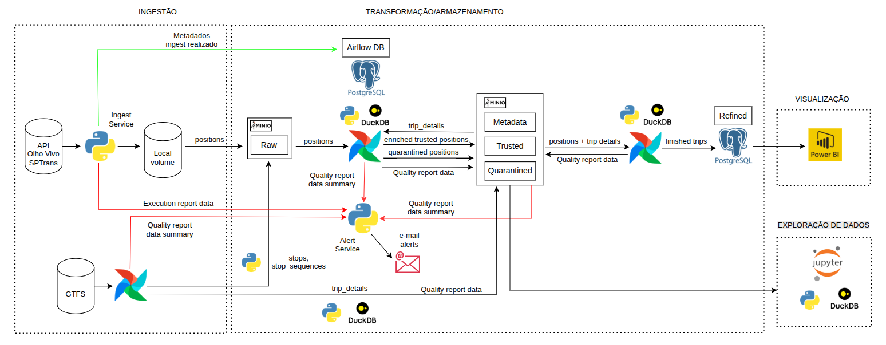

Este projeto proporciona aos seus usuários visualizações sobre as posições atuais de todos os ônibus rastreados pela SPTrans e apresenta informações sobre as viagens concluídas nas últimas horas.

Para isto, o Sptransinsights, em intervalos regulares, extrai as posições de todos os ônibus em circulação em cada momento, armazenando estes dados para gerar informações sobre as viagens de cada veículo de cada linha e, assim, proporcionar insights aos seus usuários, permitindo que identifiquem os melhores momentos para fazerem suas viagens.

A solução adota o conceito de monorepo e é composta por alguns subprojetos. Cada um deles possui um README com informações sobre o seu papel e os requisitos para o seu funcionamento.

## Arquitetura


Para implementar a solução foram adotados os componentes:
- Airflow: para orquestração de processos recorrentes do pipeline através de diversas DAGs utilizando o Python Operator. O ambiente de produção para este módulo se encontra na pasta airflow. . O enquanto o ambiente de desenvolvimento se encontra na pasta dags-dev. 
    - DAG gtfs: processo composto de 3 etapas principais.   
        - extração e carga de arquivos: que extrai os dados GTFS da SPTRANS e salva na camada raw. 
        - transformação: cria tabelas na camada trusted, a partir dos dados brutos extraído do GTFS da SPTRANS e armazenados na camada raw
        - criação de uma tabela de dados de viagens, a partir dos dados das diversas tabelas GTFS, utilizada para enriquecer os dados de posição extraídos da API SPTrans. 
    - DAG transformlivedata: processo de transformação dos dados brutos de posição da camada raw em dados enriquecidos e confiáveis na camada trusted. 
    - DAG refinelivedata: processo de transformação para criação das informações de viagens na camada refined a partir dos dados da camada trusted. 
    - DAG updatelatestposition: processo de transformação para criação dos dados de última posição de cada ônibus na camada refined a partir dos dados da camada trusted. 
- extractlivedata: microserviço que extrai os dados da API da SPTRANS a intervalos regulares, inicialmente a cada 2 minutos, mas possibilitando que este intervalo seja reduzido, o que não seria viável usando um job no Airflow, uma vez que atrasos na exeução impactariam a precisão dos intervalos entre execuções da extração de dados, publicando o dado bruto em um tópico do Kafka. 
- loadlivedata: microserviço que consome de um tópico no Kafka os dados brutos extraídos da API pelo extractlivedata e salva na camada raw, implementada usando o Minio. 
- Kafka: para desacoplar o processo de ingestão dos dados das camadas de storage e transformação
- Minio: utilizado para implementar as camadas raw, para armazenamento de dados brutos extraídos da API SPTrans e dados GTFS da SPTrans, e para os dados da camada trusted
- DuckDB: utilizado nos processos de transformação para fazer queries SQL diretamente nas tabelas armazenadas em formato Parquet na camada trusted, implementada através do Minio, com excelente performance, e sem requerer a implementação de motores SQL como o Presto, assim reduzindo a complexidade da infraestrutura. Utilizado também para análise exploratória de dados com intermédio do Jupyter
- Jupyter: usado para criar notebooks com a finalidade de viabilizar a exploração de dados na camada trusted armazenada no object storage. 
- PostgreSQL: utilizado para armazenar a camada refined, porporcionando consultas com baixa latência na camada de visualização.
- PowerBI: utilizado para implementar a camada de visualização devido a sua flexibilidade, poder e larga adoção, consumindo dados diretamente da camada refined através do recurso de direct query ao PostgreSQL. 

## Para executar o Sptransinsights
Ao iniciar o projeto seguindo as instruções abaixo, deve-se em seguida, executar alguns comandos de inicialização que estão discriminados em cada subprojeto, especialmente:
- 
- 
- 
- 
- 

Para iniciar o projeto:
 Se o arquivo .env não existir na raiz do projeto, crie-o com o seguinte conteúdo:
  MINIO_VERSION=RELEASE.2025-02-28T09-55-16Z
  POSTGRES_DEBEZIUM=3.0
  CONFLUENT_VERSION=7.6.1
  AKHQ_VERSION=0.20.0
 
 Execute:
  docker compose up -d 

 Caso deseje iniciar serviços específicos:
 ```shell
  docker compose up -d kafka-broker akhq
  docker compose up -d minio
  docker compose up -d postgres
  docker compose up -d postgres_airflow webserver scheduler
  docker compose up -d extraclivedata loadlivedata
  docker compose up -d jupyter
```

Para monitorar os serviços ou efetuar configurações:
 AKHQ (Kafka): 
 http://localhost:28080/ui/

 Minio:
 http://localhost:9001/login

 Airflow:
 http://localhost:8080/

 Jupyter:
 http://localhost:8888/

 


