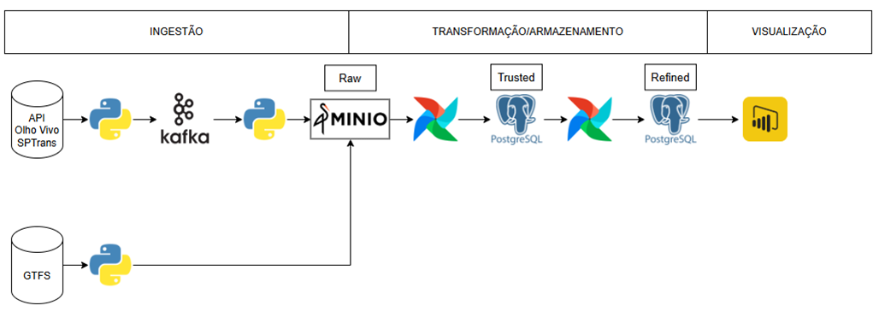

Este projeto proporciona aos seus usuários visualizações sobre as posições atuais de todos os ônibus rastreados pela SPTrans e traz informações sobre as viagens concluídas nas últimas horas.

Para isto, o Sptransinsights, em intervalos regulares, extrai as posições de todos os ônibus em circulação em cada momento, armazenando estes dados para gerar informações sobre as viagens de cada veículo de cada linha e assim proporcionar insights aos seus usuários, permitindo que identifiquem os melhores momentos para fazerem suas viagens.

Este projeto faz uso de um monorepo com diferentes subprojetos que compõe o SPTransInsights.

Cada subprojeto possui um README com informações sobre o seu papel e os requisitos para o seu funcionamento.

## Arquitetura

Para implementar a solução foram adotados os componentes:
- Airflow: para orquestração de processos recorrentes do pipeline através de diversas DAGs utilizando o Python Operator.
    - DAG gtfs: subprocesso de extractload, que extrai os dados GTFS da SPTRANS e salva na camada raw.  e transform: subprocesso processo que, a partir dos dados GTFS da SPTRANS, cria tabelas na camada trusted, implementada no Postgresql devido ao baixo volume dos dados e à facilidade de implementação, reduzindo a complexidade da arquitetura. Além disso, este processo cria uma tabela de dados de viagens utilizada para enriquecer os dados de posição extraídos da API SPTrans. 
    - DAG transformlivedata: processo de transformação dos dados brutos de posição da camada raw em dados enriquecidos na camada trusted. 
    - DAG refinelivedata: processo de transformação para criação das informações de viagens na camada refined a partir dos dados da camada trusted. 
    - DAG updatelatestposition: processo de transformação para criação dos dados de última posição de cada ônibus na camada refined a partir dos dados da camada trusted. 
- Kafka: para desacoplar o processo de ingestão dos dados das camadas de storage e 
transformação
- extractlivedata: microserviço que extrai os dados da API da SPTRANS a intervalos regulares, inicialmente a cada 2 minutos, mas possibilitando que este intervalo seja reduzido, o que não seria viável usando um job no Airflow, uma vez que atrasos na exeução impactariam a precisão dos intervalos entre execuções da extração de dados, publicando o dado bruto em um tópico do Kafka. 
- loadlivedata: microserviço que consome de um tópico no Kafka os dados brutos extraídos da API pelo extractlivedata e salva na camada raw, implementada usando o Minio. 
- Minio: utilizado para implementar a camada raw para storage de dados brutos extraídos da API SPTrans e dados GTFS da SPTrans
- PostgreSQL: utilizado para armazenar as camadas trusted e refined, simplificando a arquitetura e viabilizando consultas performáticas para a camada de visualização
- PowerBI: utilizado para implementar a camada de visualização devido a sua flexibilidade, poder e larga adoção, consumindo dados diretamente da camada refined. 

## Para executar o Sptransinsights
Ao iniciar o projeto seguindo as instruções abaixo, deve-se em seguida, executar alguns comandos de inicialização que estão discriminados em cada subprojeto, especialmente:
- airflow
- gtfsextract
- transformlivedata
- refinelivedata

Para iniciar o projeto:
 Se o arquivo .env não existir, crie com o seguinte conteúdo:
  MINIO_VERSION=RELEASE.2025-02-28T09-55-16Z
  POSTGRES_DEBEZIUM=3.0
  CONFLUENT_VERSION=7.6.1
  AKHQ_VERSION=0.20.0
 
 Execute:
  docker compose up -d 

 Caso deseje iniciar serviços específicos:
  docker compose up -d kafka-broker akhq
  docker compose up -d minio
  docker compose up -d postgres
  docker compose up -d postgres_airflow webserver scheduler
  docker compose up -d extraclivedata loadlivedata

Para monitorar os serviços ou efetuar configurações:
 AKHQ (Kafka): 
 http://localhost:28080/ui/

 Minio:
 http://localhost:9001/login

 Airflow:
 http://localhost:8080/

