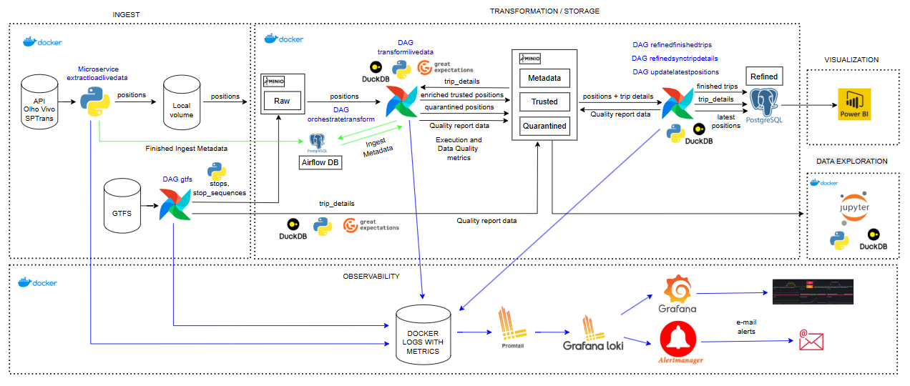

Este projeto proporciona aos seus usuários visualizações sobre as posições atuais de todos os ônibus rastreados pela SPTrans e apresenta informações sobre as viagens concluídas nas últimas horas.

Para isto, o Sptransinsights, em intervalos regulares, extrai as posições de todos os ônibus em circulação em cada momento, armazenando estes dados para gerar informações sobre as viagens de cada veículo de cada linha e, assim, proporcionar insights aos seus usuários, permitindo que identifiquem os melhores momentos para fazerem suas viagens.

A pipeline mais crítica do projeto (`transformlivedata`) aplica um framework completo de qualidade de dados, com validações orientadas a configuração (JSON Schema e Great Expectations), quarentena de registros inválidos e geração de relatório de qualidade com resumo e detalhes do processamento proporcionando informações de observabilidade.  
Observação: o resumo de qualidade é enviado via webhook para o microserviço `alertservice`, responsável por emitir notificações e alertas por e-mail.

A solução adota o conceito de monorepo e é composta por alguns subprojetos. Cada um deles possui um README com informações sobre o seu papel e os requisitos para o seu funcionamento.

## Arquitetura


Para implementar a solução foram adotados os componentes:
- Airflow: para orquestração de processos recorrentes do pipeline através de diversas DAGs utilizando o Python Operator. O ambiente de produção para este módulo se encontra na pasta airflow. . 
O ambiente de desenvolvimento se encontra na pasta dags-dev. 
Detalhes sobre as DAGS:
    - DAG gtfs: processo composto de 3 etapas principais.   
        - extração e carga de arquivos: que extrai os dados GTFS da SPTRANS e salva na camada raw. 
        - transformação: cria tabelas na camada trusted, a partir dos dados brutos extraído do GTFS da SPTRANS e armazenados na camada raw
        - criação de uma tabela de dados de viagens, a partir dos dados das diversas tabelas GTFS, utilizada para enriquecer os dados de posição extraídos da API SPTrans. 
        - Esta DAG envia um sinal ao ser finalizada com sucesso, permitindo que a DAG de sincronização dos detalhes de viagens seja iniciada automaticamente.
        
    - DAG transformlivedata: processo de transformação dos dados brutos de posição da camada raw em dados enriquecidos e confiáveis na camada trusted. 
        - Validação do JSON bruto via JSON Schema (configuração externa)
        - Validação pós-transformação via Great Expectations (suite externa)
        - Quarentena de registros inválidos
        - Relatório de qualidade em JSON com `summary` e `details`, incluindo métricas, issues e informações parciais em caso de falha
        
    - DAG orchestratetransform: processo de identificação de dados de posição dos ônibus pendentes de processamento e que dispara a DAG de transformação.  
    - DAG refinedfinishedtrips: processo de transformação para criação das informações de viagens na camada refined a partir dos dados da camada trusted. 
    - DAG refinedsynctripdetails: processo de sincronização dos detalhes de viagens da camada trusted para a camada refined para utilização pela camada de visualização. Esta DAG é iniciada assim que a DAG gtfs é finalizada com sucesso. 
    - DAG updatelatestposition: processo de transformação para criação dos dados de última posição de cada ônibus na camada refined a partir dos dados da camada trusted. 

- extractloadlivedata: microserviço que extrai os dados da API da SPTRANS a intervalos regulares, inicialmente a cada 2 minutos, mas possibilitando que este intervalo seja reduzido, o que não seria viável usando um job no Airflow, uma vez que atrasos na execução impactariam a precisão dos intervalos entre execuções da extração de dados, e salvando em um volume local e em seguida na camada raw, implementada usando o Minio. 
- alertservice: microserviço que recebe resumos de qualidade via webhook e envia notificações por e-mail, com alertas imediatos para falhas e alertas cumulativos para warnings. 
- Minio: utilizado para implementar as camadas raw, para armazenamento de dados brutos extraídos da API SPTrans e dados GTFS da SPTrans, e para os dados da camada trusted
- DuckDB: utilizado nos processos de transformação para fazer queries SQL diretamente nas tabelas armazenadas em formato Parquet na camada trusted, implementada através do Minio, com excelente performance, e sem requerer a implementação de motores SQL como o Presto, assim reduzindo a complexidade da infraestrutura. Utilizado também para análise exploratória de dados com intermédio do Jupyter
- Jupyter: usado para criar notebooks com a finalidade de viabilizar a exploração de dados na camada trusted armazenada no object storage. 
- PostgreSQL: utilizado para armazenar a camada refined, porporcionando consultas com baixa latência na camada de visualização.
- PowerBI: utilizado para implementar a camada de visualização devido a sua flexibilidade, poder e larga adoção, consumindo dados diretamente da camada refined através do recurso de direct query ao PostgreSQL. 

## Para executar o Sptransinsights
Ao iniciar o projeto seguindo as instruções abaixo, deve-se em seguida, executar alguns comandos de inicialização que estão discriminados em cada subprojeto, especialmente:
- 
- 
- 
- 
- 
- 
- 

Para iniciar o projeto:
 Se o arquivo `.env` não existir na raiz do projeto, crie-o com o seguinte conteúdo:
```dotenv
MINIO_VERSION=RELEASE.2025-02-28T09-55-16Z

# alertservice SMTP credentials
ALERTSERVICE_SMTP_USER=<seu_usuario_smtp>
ALERTSERVICE_SMTP_PASSWORD=<sua_senha_smtp>

# extractloadlivedata credentials
EXTRACTLOADLIVEDATA_TOKEN=<token_sptrans_api>
EXTRACTLOADLIVEDATA_ACCESS_KEY=<minio_access_key>
EXTRACTLOADLIVEDATA_SECRET_KEY=<minio_secret_key>
EXTRACTLOADLIVEDATA_DB_USER=<db_user>
EXTRACTLOADLIVEDATA_DB_PASSWORD=<db_password>
EXTRACTLOADLIVEDATA_AIRFLOW_USER=<airflow_user>
EXTRACTLOADLIVEDATA_AIRFLOW_PASSWORD=<airflow_password>
```
 
 Execute:
  docker compose up -d 

 Caso deseje iniciar serviços específicos:
 ```shell
  docker compose up -d minio
  docker compose up -d postgres
  docker compose up -d postgres_airflow airflow_webserver airflow_scheduler
  docker compose up -d extractloadlivedata
  docker compose up -d alertservice
  docker compose up -d jupyter
```


## Para monitorar os serviços ou efetuar configurações:

 Minio:
 http://localhost:9001/login

 Airflow:
 http://localhost:8080/

 Jupyter:
 http://localhost:8888/

## Configuração unificada de pipelines
Para padronizar a configuração entre pipelines e ambientes, o projeto utiliza o módulo `pipeline_configurator` (em `dags-dev/pipeline_configurator` e promovido para `airflow/dags/pipeline_configurator`).  
Ele fornece um único ponto de entrada para carregar configurações e conexões, com validação estruturada via schemas Pydantic específicos para cada pipeline.

Padrão de saída (contrato canônico):
- `general`: parâmetros funcionais da pipeline (ex.: buckets, tabelas, pastas, janelas de análise)
- `connections`: credenciais e endpoints (ex.: `object_storage`, `database`, `http`)
- `raw_data_json_schema`: schema de validação do formato dos dados JSON provenientes da ingestão de dados da API, quando aplicável 
- `data_expectations`: suite de expectations para checagem de qualidade do pipeline, quando aplicável 

O módulo resolve automaticamente o ambiente de execução:
- **Local/dev**: carrega arquivos JSON de configuração e `.env` locais
- **Airflow**: usa Variables e Connections do Airflow

Esse padrão reduz acoplamento entre serviços e garante consistência entre todos os pipelines.


## Ciclo de Desenvolvimento e Deployment

Para garantir a estabilidade do ambiente de produção, o projeto adota um fluxo de Promotion-based Development. No caso dos pipelines, todo o código é desenvolvido e testado no diretório `dags-dev` e, após validado, é "promovido" para o diretório de produção do Airflow (`airflow/dags`).

### Promoção de Pipelines (DAGs)
Para promover uma pipeline (ex: `transformlivedata`), utilize o script de gateway que realiza automaticamente a verificação de sintaxe (Linting), SAST e testes unitários antes de sincronizar os arquivos com a produção:

```shell
# Sintaxe: python scripts/promote_pipeline.py <nome_da_pipeline>
python scripts/promote_pipeline.py transformlivedata
```

Este script realiza os seguintes passos:
1. Análise estática: executa o `ruff` no subdiretório da pipeline.
2. SAST: executa o `bandit` (alta severidade) no subdiretório da pipeline.
3. Testes de unidade: executa o `pytest` na pasta `tests/` da pipeline (se existir).
4. Sincronização do código: sincroniza o subdiretório da pipeline para produção.
5. Sincronização de infraestrutura compartilhada: sincroniza as pastas `infra`, `quality` e `pipeline_configurator` para produção.

O número total de passos exibido é ajustado automaticamente com base na presença de testes.

### Deployment de Microserviços
Para atualizar e reiniciar um microserviço (ex: `extractloadlivedata`), utilize o script de deployment:

```shell
# Sintaxe: python scripts/deploy_service.py <nome_do_servico> <diretorio_do_servico>
python scripts/deploy_service.py extractloadlivedata extractloadlivedata
```

Este script realiza os seguintes passos:
1. Análise estática: executa o `ruff` no diretório do serviço.
2. SAST: executa o `bandit` (alta severidade) no diretório do serviço.
3. Testes de unidade: executa o `pytest` na pasta `tests/` do serviço (se existir).
4. Build da imagem Docker via Docker Compose.
5. Reinício do container via Docker Compose.

### Scripts auxiliares
Os scripts de deployment compartilham dois módulos auxiliares em `scripts/`:

| Módulo | Responsabilidade |
|---|---|
| `os_command_helper.py` | `run_command(command, error_msg)` — executa subprocessos com `shell=False` e reporta o exit code em caso de falha |
| `deploy_helpers.py` | `run_code_validations(folder, label, step_offset)` — executa linting, SAST e testes, retornando o número de passos consumidos para alinhamento do contador de steps |


## Decisões arquiteturais (ADRs)
As principais decisões de design do projeto — tecnologias escolhidas, alternativas descartadas e tradeoffs aceitos — estão documentadas como Architecture Decision Records em `docs/adr/`. Os oito ADRs cobrem desde a escolha da arquitetura Medallion e do DuckDB como motor de transformação até o design da fila durável com PostgreSQL, o framework de qualidade de dados multi-camada, o design do alertservice e o workflow de promoção de pipelines.


