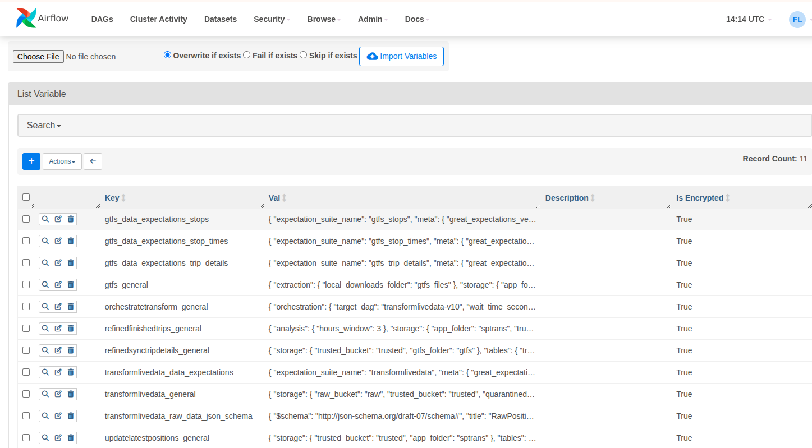
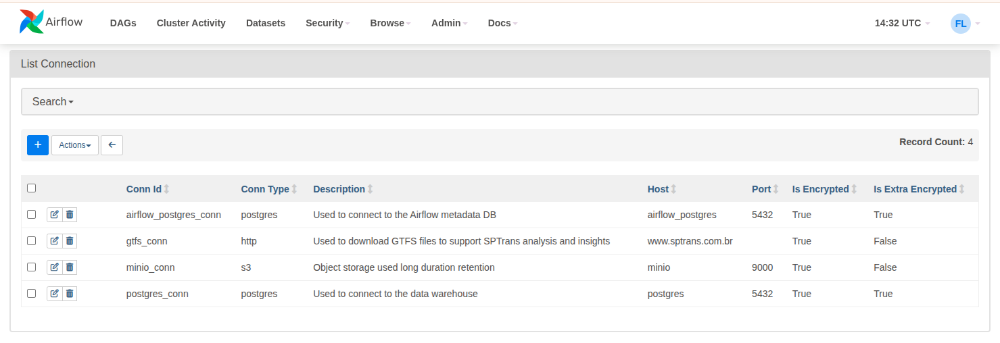

## Purpose

Airflow is the workflow orchestrator used in this project to manage pipeline execution through predefined schedules or event-driven triggers.

All pipeline configurations are stored as Airflow Variables and loaded through `Variable.get` calls executed by the [pipeline configurator](../dags-dev/pipeline_configurator/README-EN.md) module, as shown below:



All credentials used by the pipelines are stored as Airflow Connections and loaded through `BaseHook.get_connection` calls executed by the [pipeline configurator](../dags-dev/pipeline_configurator/README-EN.md) module.



[More information about Airflow’s role in the project architecture and the implemented DAGs](../README-EN.md)

This approach centralizes the management of pipeline configuration and credentials, since changes and imports can be performed by Airflow users with administrative privileges.

## Initializing the environment

To initialize the Airflow-specific services, run:

```bash
docker compose up -d airflow_postgres airflow_webserver airflow_scheduler
```

The recommended operational path for Airflow bootstrap is:

```bash
./automation/bootstrap_airflow_app.sh
```

This script:
- waits until the Airflow CLI is usable
- ensures the admin user defined in `.env` exists
- imports the bootstrap Variables
- imports the bootstrap Connections

## Manual fallback commands

If you need to bootstrap Airflow manually, the commands below remain available.

### Create the Airflow login user

After starting the services, create an admin user to access the Airflow UI:

```bash
docker compose exec airflow_webserver airflow users create \
    --username admin \
    --firstname Firstname \
    --lastname Lastname \
    --role Admin \
    --email admin@example.com \
    --password admin
```

### Import connections and variables

To import the connections and variables used by the DAGs:

Bootstrap is split into:
- `connections.json`: versioned template containing the base structure of the Airflow Connections
- `variables.json`: consolidated variables for pipelines that do not require additional dedicated files in this bootstrap
- dedicated JSON files per pipeline: used when configuration is maintained separately

```bash
docker compose exec airflow_webserver bash
python /opt/airflow/dags/../variables_and_connections/render_airflow_connections.py \
  /opt/airflow/variables_and_connections/connections.json \
  /opt/airflow/variables_and_connections/generated_connections.json
airflow connections import variables_and_connections/generated_connections.json
airflow variables import variables_and_connections/variables.json

# transformlivedata
airflow variables import variables_and_connections/transformlivedata_general.json
airflow variables import variables_and_connections/transformlivedata_data_expectations.json
airflow variables import variables_and_connections/transformlivedata_raw_data_json_schema.json

# gtfs
airflow variables import variables_and_connections/gtfs_general.json
airflow variables import variables_and_connections/gtfs_data_expectations_stops.json
airflow variables import variables_and_connections/gtfs_data_expectations_stop_times.json
airflow variables import variables_and_connections/gtfs_data_expectations_trip_details.json

# refinedfinishedtrips
airflow variables import variables_and_connections/refinedfinishedtrips_general.json
```

The `variables.json` file already contains:
- `orchestratetransform_general`
- `updatelatestpositions_general`
- `refinedsynctripdetails_general`

That means these three configurations are already loaded in the consolidated import and do not require additional dedicated files at this stage.

## Airflow integration with the ingest service

API data ingestion is performed by the [extractloadlivedata](../extractloadlivedata/README-EN.md) service.
It integrates with Airflow as follows:
- for each file generated by the service and saved to the raw layer, a processing request is saved to the `to_be_processed.raw` table in the Airflow database
- the `orchestratetransform` DAG identifies pending requests and triggers the transformation DAG
- DAGs that consume transformed data run in an event-driven way using Airflow Datasets

This allows the resilience built into the ingestion and transformation flow to recover from failures both in Airflow and in object storage.

Alternatively, the ingest service can be configured to trigger the transformation DAG directly through the Airflow API, although this is not the production path adopted by the project.

## Optional API-trigger configuration

To allow `extractloadlivedata` to trigger DAG execution directly through the Airflow API:

```bash
airflow roles create API_Trigger
airflow roles add-perms API_Trigger -a can_read -r "DAGs"
airflow roles add-perms API_Trigger -a can_read -r "DAG Runs"
airflow roles add-perms API_Trigger -a can_create -r "DAG Runs"
airflow roles add-perms API_Trigger -a can_read -r "DAG:transformlivedata-v10"
airflow roles add-perms API_Trigger -a can_edit -r "DAGs"
airflow users create \
    --username ingest_service \
    --firstname Ingest \
    --lastname Service \
    --role API_Trigger \
    --email ingest@example.com \
    --password ingest_password
```

After that, to complete the API-trigger integration, configure the ingest service to use the credentials created above, along with the name of the DAG that Airflow should trigger.

## Access Airflow

Web UI:

`http://localhost:8080/`
