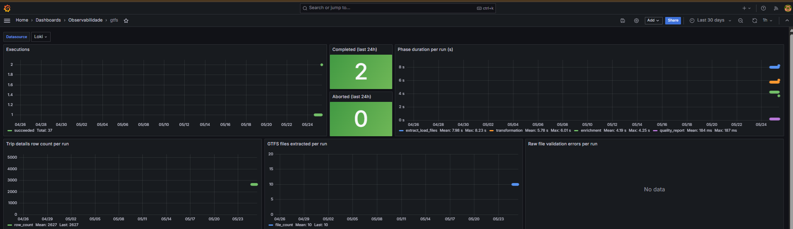

## Objetivos deste subprojeto
Fazer a extração dos arquivos GTFS do portal do desenvolvedor da SPTrans para enriquecimento dos dados extraídos da API. 
A implementação final é feita via a DAG gtfs do Airflow.
O desenvolvimento é feito em uma pasta dag-dev que contem cada um dos subprojetos implementados via Airflow, aumentando a agilidade durante a experimentação.
As configurações são carregadas de forma automática via `pipeline_configurator`, de acordo com o ambiente de execução, seja produção (Airflow) ou desenvolvimento local.


## O que este subprojeto faz
- download de arquivos GTFS do portal do desenvolvedor da SPTrans utilizados para enriquecer dados das posicoes dos onibus obtidas via API
- valida os arquivos extraídos antes da carga na camada raw verificando sua existência e se o formato é CSV, além de um número mínimo de linhas mínimas)
- salva cada um dos arquivos na "pasta" gtfs do bucket raw no serviço de object storage
- executa a **TRANSFORMATION STAGE** para as tabelas base do GTFS:
  - transforma CSV em Parquet
  - valida com Great Expectations quando houver suite configurada para a tabela
  - salva primeiro em staging na camada trusted
  - em caso de falha de validação: move artefatos staged para quarentena e gera diagnóstico consolidado
  - em caso de sucesso: move artefatos staged para o caminho final para cada tabela
- executa a **ENRICHMENT STAGE** para `trip_details` com abordagem staging-first:
  - cria `trip_details` em `trusted/<gtfs_folder>/<staging_subfolder>/trip_details.parquet`
  - valida `trip_details` com Great Expectations quando houver suite configurada
  - em caso de falha de validação: move para `trusted/<gtfs_folder>/<quarantined_subfolder>/trip_details.parquet`
  - em caso de sucesso: move para `trusted/<gtfs_folder>/trip_details/trip_details.parquet`
- gera um único relatório consolidado de qualidade por execução da pipeline (`EXTRACT & LOAD`, `TRANSFORMATION`, `ENRICHMENT`)
- inclui artefato de linhagem de colunas de `trip_details` com detecção de drift (`warning: "lineage drift detected"`) quando a saída divergir do mapeamento declarado

## Pré-requisitos
- Obter as credenciais cadastre-se no portal do desenvolvedor da SPTRANS
- Disponibilidade de dois buckets: uma para a camada raw e outro para a camada trusted, previamente criados no serviço de object storage
- Criação de uma chave de acesso ao serviço de object storage cadastrada no arquivo de configurações com acesso de leitura e escrita aos bucket das camadas raw e trusted 
- Arquivo `.env` com as credenciais necessárias
- Um template está disponível em `.env.example`
- Criação do arquivo de configurações

## Configurações
As configurações são centralizadas no módulo `pipeline_configurator` e expostas como um objeto canônico com:
- `general`
- `connections`

### Local/dev
- `general` vem do arquivo `dags-dev/gtfs/config/gtfs_general.json`
- `.env` em `dags-dev/gtfs/.env` é usado apenas para credenciais de conexão

Credenciais esperadas no `.env`:
GTFS_URL="http://www.sptrans.com.br/umbraco/Surface/PerfilDesenvolvedor/BaixarGTFS"
LOGIN=<insira seu login>
PASSWORD=<insira sua senha>
MINIO_ENDPOINT=<hostname:port>
ACCESS_KEY=<key>
SECRET_KEY=<secret>

Chaves esperadas em `general`
```json
{
  "extraction": {
    "local_downloads_folder": "gtfs_files"
  },
  "storage": {
    "app_folder": "sptrans",
    "gtfs_folder": "gtfs",
    "raw_bucket": "raw",
    "metadata_bucket": "metadata",
    "quality_report_folder": "quality-reports",
    "quarantined_subfolder": "quarantined",
    "staging_subfolder": "staging",
    "trusted_bucket": "trusted"
  },
  "tables": {
    "trip_details_table_name": "trip_details"
  },
  "notifications": {
    "webhook_url": "disabled"
  },
  "data_validations": {
    "expectations_validation": {
      "expectations_suites": [
        "data_expectations_stops",
        "data_expectations_stop_times",
        "data_expectations_trip_details"
      ]
    }
  }
}
```

Artefatos de expectations carregados automaticamente via `pipeline_configurator`:
- `dags-dev/gtfs/config/gtfs_data_expectations_stops.json`
- `dags-dev/gtfs/config/gtfs_data_expectations_stop_times.json`
- `dags-dev/gtfs/config/gtfs_data_expectations_trip_details.json`

### Fluxo da TRANSFORMATION STAGE
- Tabelas processadas: `stops`, `stop_times`, `routes`, `trips`, `frequencies`, `calendar`
- Caminhos na camada trusted:
  - Staging: `trusted/<gtfs_folder>/<staging_subfolder>/<table>.parquet`
  - Quarentena: `trusted/<gtfs_folder>/<quarantined_subfolder>/<table>.parquet`
  - Final: `trusted/<gtfs_folder>/<table>/<table>.parquet`

### Fluxo da ENRICHMENT STAGE (`trip_details`)
- Caminho de staging: `trusted/<gtfs_folder>/<staging_subfolder>/trip_details.parquet`
- Caminho de quarentena: `trusted/<gtfs_folder>/<quarantined_subfolder>/trip_details.parquet`
- Caminho final: `trusted/<gtfs_folder>/trip_details/trip_details.parquet`
- A validação GX de `trip_details` usa a suite `data_expectations_trip_details` quando configurada.
- Em falhas após escrita em staging, a pipeline tenta quarentenar o artefato staged para evitar resíduos órfãos.
- Na pasta [samples](./samples) há um exemplo curado manualmente do artefato `trip_details`: [trip_details.parquet](./samples/trip_details.parquet), apenas para referência documental.

### Relatório consolidado de qualidade
- Há exatamente um relatório por execução de `gtfs-v3.py`, com `summary` + `details`.
- O relatório consolida o resultado das três fases:
  - `extract_load_files`
  - `transformation`
  - `enrichment`
- Caminho do relatório:
  - `<metadata_bucket>/<quality_report_folder>/gtfs/year=YYYY/month=MM/day=DD/hour=HH/quality-report-gtfs_<HHMM>_<execution_suffix>.json`
- A construção e persistência do relatório delegam para `quality.reporting` (`build_quality_report_path`, `build_quality_summary`, `save_quality_report`).
- A seção `summary` segue o contrato padrão definido em `quality.reporting`, com os campos adicionais específicos da pipeline GTFS: `stage`, `validated_items_count`, `relocation_status`, `relocation_error`.
- `acceptance_rate` é um valor contínuo entre 0.0 e 1.0, calculado como `(validated_items_count - rows_failed) / validated_items_count` sobre o total de itens processados em todas as fases. Antes era binário (0.0 ou 1.0).
- Na pasta [samples](./samples) há um exemplo curado manualmente do relatório consolidado de qualidade: [quality-report-gtfs_HHMM_uuid.json](./samples/quality-report-gtfs_HHMM_uuid.json).

### Relato de qualidade e notificação (alertservice)
- Em falhas de qualquer fase, a pipeline gera e persiste um relatório consolidado com:
  - `failure_phase`
  - `failure_message`
  - resultados de cada fase em `details.stages`
  - `validated_items_count`, `error_details`, `relocation_status`, `relocation_error` por fase
  - artefatos de `column_lineage` no estágio de enrichment
- O resumo (`summary`) é enviado via webhook para o microserviço `alertservice` quando este está habilitado.
- O resumo contém informações de status, fases de falha e métricas de validação para disparar alertas imediatos (FAIL) ou cumulativos (WARN) configurados no alertservice.
- A notificação é disparada pela DAG (`_send_webhook_from_report`) após a persistência do relatório, de forma separada do serviço de construção do relatório.

### Observabilidade (Loki + Grafana)

A observabilidade desta pipeline é baseada em logging estruturado: todos os eventos são emitidos em JSON com os campos `service`, `event`, `status`, `execution_id`. No ambiente com Airflow, os logs são coletados pelo Promtail e enviados ao Loki.

#### Taxonomia de eventos

Eventos emitidos pelo **orquestrador**:

| Evento | Quando | Conteúdo relevante |
|---|---|---|
| `execution_started` | Início da execução | `execution_id` |
| `execution_finished` | Execução concluída com sucesso | `execution_id`, `status` |
| `execution_aborted` | Qualquer fase falha e interrompe o pipeline | `execution_id`, `status`, `metadata.phase` |
| `execution_phase_metrics` | Ao final de toda execução (sucesso ou falha) | `metadata.phase_metrics.<fase>.duration_seconds`, `metadata.overall_status` |

Fases rastreadas em `execution_phase_metrics`: `extract_load_files`, `transformation`, `enrichment`, `quality_report`.

Eventos emitidos pelos serviços — **Extract & Load**:

| Evento | Quando | Conteúdo relevante |
|---|---|---|
| `gtfs_extraction_started` | Início do download dos arquivos GTFS | — |
| `gtfs_extraction_succeeded` | Arquivos extraídos com sucesso | `metadata.file_count`, `metadata.downloads_folder` |
| `gtfs_extraction_failed` | Falha no download | `error_type`, `error_message` |
| `raw_validation_started` | Início da validação dos CSVs brutos | — |
| `raw_file_validation_error` | Um arquivo não passou na validação | `metadata.file`, `metadata.reason` |
| `raw_validation_completed` | Validação dos CSVs concluída | — |
| `raw_files_upload_started` | Início do upload para raw storage | — |
| `raw_files_upload_succeeded` | Upload concluído | — |

Eventos emitidos pelos serviços — **Transformation**:

| Evento | Quando | Conteúdo relevante |
|---|---|---|
| `csv_load_started` | Início do carregamento de um CSV da camada raw | `metadata.table` |
| `csv_load_succeeded` | CSV carregado com sucesso | `metadata.table` |
| `csv_load_failed` | Falha no carregamento do CSV | `metadata.table` |
| `table_transform_started` | Início da transformação de uma tabela | `metadata.table` |
| `table_csv_load_failed` | Falha ao carregar CSV durante transformação | `metadata.table` |
| `table_csv_parse_failed` | Falha ao parsear CSV | `metadata.table` |
| `table_validation_started` | Início da validação GX de uma tabela | `metadata.table` |
| `table_validation_failed` | Validação GX falhou | `metadata.table`, `metadata.failures` |
| `table_validation_skipped` | Nenhuma suite GX configurada para a tabela | `metadata.table` |
| `table_staging_failed` | Falha ao persistir em staging no trusted bucket | `metadata.table` |
| `table_transform_succeeded` | Transformação da tabela concluída | `metadata.table` |
| `buffer_save_started` | Início do salvamento do buffer no object storage | — |
| `buffer_save_succeeded` | Buffer salvo com sucesso | — |
| `buffer_save_failed` | Falha ao salvar buffer | `error_type`, `error_message` |
| `file_relocation_started` | Início da relocalização (staging → final ou quarentena) | `metadata.source`, `metadata.destination` |
| `file_relocation_item_failed` | Um arquivo falhou na relocalização | `metadata.file` |
| `file_relocation_completed` | Relocalização concluída | `metadata.relocated_count` |

Eventos emitidos pelos serviços — **Enrichment**:

| Evento | Quando | Conteúdo relevante |
|---|---|---|
| `trip_details_creation_started` | Início da criação da tabela `trip_details` | — |
| `trip_details_creation_succeeded` | `trip_details` criado e exportado para staging | `metadata.row_count`, `metadata.path` |
| `trip_details_creation_failed` | Falha na criação do `trip_details` | `error_type`, `error_message` |

#### Dashboard Grafana

O dashboard está em [`observability/grafana/provisioning/dashboards/gtfs.json`](../../../../observability/grafana/provisioning/dashboards/gtfs.json) e é provisionado automaticamente pelo Grafana. Utiliza Loki como datasource. Todas as queries seguem o padrão:

```
{service="airflow_tasks"} | json | service_extracted="gtfs" | event="<evento>"
```



Janela padrão: `now-30d`. Atualização: `1h`. O dashboard está organizado em três linhas:

**Linha 1 — Saúde operacional**

| Painel | Tipo | O que mostra | Evento Loki / campo |
|---|---|---|---|
| Executions | Timeseries (pontos) | Execuções concluídas (verde) e abortadas (vermelho) ao longo do tempo | `execution_finished` e `execution_aborted` — `count_over_time [1d]` |
| Completed (last 24h) | Stat (verde) | Total de execuções bem-sucedidas nas últimas 24h | `execution_finished` — `count_over_time [24h]` |
| Aborted (last 24h) | Stat (vermelho se ≥ 1) | Total de execuções abortadas nas últimas 24h | `execution_aborted` — `count_over_time [24h]` |
| Phase duration per run (s) | Timeseries | Duração por fase: `extract_load_files`, `transformation`, `enrichment`, `quality_report` | `execution_phase_metrics` — `metadata.phase_metrics.<fase>.duration_seconds` via `avg_over_time [1d]` |

**Linha 2 — Volume de dados**

| Painel | Tipo | O que mostra | Evento Loki / campo |
|---|---|---|---|
| Trip details row count per run | Timeseries | Linhas na tabela `trip_details` produzida por execução | `trip_details_creation_succeeded` — `metadata.row_count` via `last_over_time [1d]` |
| GTFS files extracted per run | Timeseries | Quantidade de arquivos GTFS extraídos por execução | `gtfs_extraction_succeeded` — `metadata.file_count` via `last_over_time [1d]` |
| Raw file validation errors per run | Timeseries | Quantidade de erros de validação nos CSVs brutos | `raw_file_validation_error` — `count_over_time [1d]` |

**Linha 3 — Logs**

| Painel | O que mostra |
|---|---|
| Recent aborted executions | Stream filtrado dos eventos `execution_aborted` com fase e mensagem de falha |
| Log stream | Todos os eventos da pipeline em ordem decrescente |

### Regras de teste
- Os testes da pipeline GTFS usam fakes em `gtfs/tests/fakes/` e injeção de dependências.
- Não usar `monkeypatch`: os cenários devem ser cobertos com doubles explícitos (fakes/stubs) reutilizáveis.
- Para executar:
  - `pytest gtfs/tests`
  - `pytest gtfs/tests --cov=gtfs --cov-report=term-missing`

### Airflow (produção)
No Airflow, as configurações e credenciais são gerenciadas utilzando-se os recursos de Variables e Connections que são armazenadas pelo próprio Airflow, conforme listado a seguir. Qualquer alteração nessas informações deve ser feitas via UI do Airflow ou via linha de comando conectando-se ao webserver do Airflow via comando docker exec.
- Variable `gtfs_general` (JSON)
- Credenciais via Connections (GTFS e MinIO)

## Instruções para instalação
Para instalar os requisitos:
- cd dags-dev
- python3 -m venv .venv
- source .venv/bin/activate
- pip install -r requirements.txt

## Instruções para execução em modo local
Crie `dags-dev/gtfs/.env` com base em `.env.example` preenchendo todos os campos:

```shell
Execute:
```shell
python ./gtfs-v<version number>.py
```

Exemplo: 
```shell
python ./gtfs-v6.py
```
