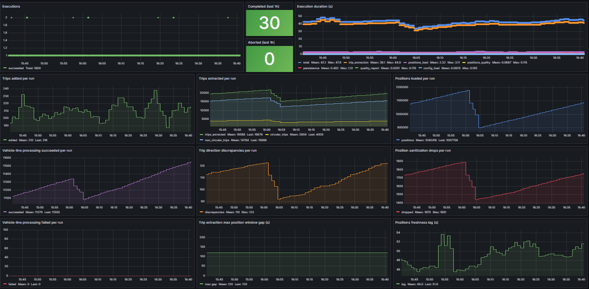

## Purpose of this subproject

Compute finished trips from the history of real-time bus positions and store their consolidated history for efficiency analysis.
The final production implementation runs through the Airflow `refinedfinishedtrips` DAG.
Development happens inside `dags-dev`, which contains the Airflow-based subprojects and speeds up local experimentation.
Configuration is loaded automatically through `pipeline_configurator`, according to the execution environment, either production (Airflow) or local development.

## What this subproject does

For each route and vehicle:
- reads real-time positions stored in the `positions` table under the `sptrans` area of the trusted bucket in the object storage service, partitioned by year, month, day, and hour, for a given analysis time window
- checks the quality of position data before processing trips by running two validations:
  - **freshness**: validates whether the most recent vehicle timestamp is within the expected staleness threshold relative to the execution `logical_date`, not the environment wall-clock time
  - **extraction gaps**: validates whether there are no significant gaps between extraction timestamps in the recent window
- if quality checks fail: stops the pipeline and saves a quality report to the metadata bucket
- if quality checks produce a warning: saves a quality report to the metadata bucket and continues processing
- computes finished trips during the analysis time window
- checks the quality of trip extraction by running three validations over the effective extraction window, measured by the interval between the first and last `extracao_ts` in the dataset:
  - **zero trips**: warning if the effective extraction window exceeds the configured threshold and no trip is identified
  - **low trip count**: warning if the effective extraction window exceeds the configured threshold and the number of identified trips is below the expected minimum
  - **vehicle group failure rate**: warning if the rate of processing failures per route/vehicle group exceeds the configured threshold; isolated failures do not stop execution — they reflect data quality degradation in upstream data
- if a failure occurs during the trip-extraction phase: saves a failure report with the partial results already available and stops execution
- saves finished trips to the refined layer implemented in the low-latency analytical database for use by the visualization layer
- checks the persistence result, recording how many trips:
  - were actually inserted in this execution
  - had already been saved previously
- if a failure occurs during the persistence phase: saves a failure report with the partial results already available and stops execution
- at the end of every successful execution, saves a complete quality report to the metadata bucket with the consolidated status of the three phases: positions, trip extraction, and persistence

## Airflow Dataset integration

**Inlet** — triggered by the Dataset `sptrans://trusted/transformed_positions_ready` published by `transformlivedata`. The consumed payload carries:
```json
{"logical_date_string": "2026-06-08T15:00:00+00:00"}
```

**Outlet** — after successful completion, publishes the Dataset `sptrans://refined/finished_trips_ready`. The emitted payload carries:
```json
{"logical_date_string": "2026-06-08T15:00:00+00:00"}
```

## Trip extraction algorithm

The current algorithm was designed to produce trips with higher operational fidelity, especially in three key dimensions for analysis:
- `trip_start_time`
- `trip_end_time`
- `duration_seconds`

These fields are especially sensitive to common noise in production position data, such as:
- a bus standing still at a terminal before starting a trip
- `linha_sentido` changes at operational boundary moments
- isolated spatial samples incompatible with the real path
- processing windows that start or end in the middle of an operational cycle

For this reason, extraction does not rely solely on `linha_sentido`. The logic uses geolocation primarily to identify the beginning and end of trips, and uses `linha_sentido` only as a complementary signal when needed, especially for circular routes.

### 1. Spatial sanitization of positions

Before extracting trips, the pipeline sanitizes the sequence of positions for each route/vehicle combination.

This sanitization removes isolated spatially invalid samples characterized by:
- an intermediate point incompatible with the previous point
- also incompatible with the next point
- while the direct link between previous and next remains plausible

In practice, this removes isolated "teleport" points without discarding full sequences of data.
This step is important because a single invalid spatial point can:
- artificially anticipate a trip start
- close a trip at the wrong place
- incorrectly inflate or reduce the observed duration

As a result, final extraction becomes more stable and more faithful to the vehicle's actual movement.

### 2. Non-circular routes

For non-circular routes, the algorithm uses geographic proximity to the reference terminals:
- `first_stop`
- `last_stop`

A trip is formed when:
- the vehicle is observed near one terminal
- then moves away from that terminal
- and later arrives at the opposite terminal

The trip start is recorded as the last position still close to the departure terminal before actual movement begins.
The trip end is recorded when the vehicle enters the proximity zone of the arrival terminal.

This means detection depends on the observed spatial path, not only on `linha_sentido`.
This strategy is needed because:
- the bus may remain stopped at the terminal for several collection cycles before departure
- `linha_sentido` may change at boundary moments before or after effective movement

By using the observed spatial boundary, the algorithm directly improves:
- trip start accuracy
- trip end accuracy
- the quality of the calculated duration

### 3. Circular routes

For circular routes, the algorithm uses a combination of two boundary signals:
- proximity to the terminal/anchor
- `linha_sentido` change

After the vehicle first synchronizes with the terminal region, the algorithm detects trips considering that:
- a trip may start when leaving the terminal
- a trip may also start when `linha_sentido` changes
- a trip may end when returning to the terminal
- a trip may also end when `linha_sentido` changes

This avoids losing trips when the analysis window starts in the middle of a cycle or when the direction change happens outside the terminal area.
This behavior matters because, in circular routes:
- the processing window may not capture the departure from the terminal
- one trip may need to be closed on return to the terminal
- another may need to be segmented by an operational `linha_sentido` change

Without this combination of signals, circular trips would tend to be underdetected or have imprecise temporal boundaries.

### 4. Removing terminal idle time

Periods when the bus stays parked waiting to begin operation should not inflate trip duration.

For this reason, the algorithm:
- removes terminal dwell from the beginning of the trip
- uses as the effective start the last terminal position immediately before actual departure

This removal is applied only in terminal context, not during in-route movement.
It is necessary so that duration reflects operating time, not parked waiting time before departure.

### 5. Direction validation

The `linha_sentido` field is not used as the sole basis for discovering trips.

It is used as a complementary signal:
- mainly for segmenting circular routes
- and for validating consistency of the detected trip

During validation, the algorithm disregards boundary samples near terminals, because in those regions `linha_sentido` may change before or after actual movement due to collection granularity.

Together, these decisions make the finished-trips table more reliable for:
- operational efficiency analysis
- duration comparison between trips
- cycle and regularity evaluation
- analytical consumption in the visualization layer

## Quality reporting and observability

The pipeline produces structured reports for three phases:
- `positions`
- `trip_extraction`
- `persistence`

Failure reports preserve the partial results available up to the interruption point.
This means a failure in `trip_extraction` or `persistence` does not lose the context already computed in previous phases.

In the final report, the `trip_extraction` phase also exposes aggregated operational metrics from the execution, including:
- `trips_extracted`
- `source_sentido_discrepancies`
- `sanitization_dropped_points`
- `input_position_records`
- `circular_trips`
- `non_circular_trips`
- `checks` — results of the three quality validations, each with a `status` and detailed evaluation fields; the `vehicle_group_failure_rate` check includes `vehicle_line_processing_succeeded`, `vehicle_line_processing_failed`, and `vehicle_line_processing_failure_rate`

The final report also includes, under `details.artifacts.column_lineage`, the declared lineage of the columns persisted to `refined.finished_trips`:
- `trip_id`
- `vehicle_id`
- `trip_start_time`
- `trip_end_time`
- `duration_seconds`
- `is_circular`
- `distance_meters`
- `avg_speed_kmh`
- `logic_date`

This lineage is validated against the real output contract of the pipeline.
If there is any divergence between declared columns and the columns actually produced/persisted, the artifact records:
- `drift_detected: true`
- `warning: "lineage drift detected"`

This lineage drift is reported as a governance artifact in the quality report and does not, by itself, interrupt execution.

The `persistence` phase of the final report directly exposes the persistence result, including:
- `added_rows`
- `previously_saved_rows`

The [samples](./samples) folder contains a manually curated example of the consolidated quality report: [quality-report-refinedfinishedtrips_HHMM_uuid.json](./samples/quality-report-refinedfinishedtrips_HHMM_uuid.json).

### Observability (Loki + Grafana stack)

Observability for this pipeline is based on structured logging: all events are emitted as JSON with the fields `service`, `event`, `status`, `execution_id`, and `correlation_id`. In the Airflow environment, logs are collected by Promtail and forwarded to Loki.

#### Event taxonomy

Each pipeline phase emits lifecycle events (`_started`, `_succeeded`). Four consolidated events are emitted at the end of each execution:

| Event | When | Relevant content |
|---|---|---|
| `execution_finished` | Execution completed successfully | `execution_id`, `correlation_id`, `status` |
| `execution_aborted` | Any phase fails and stops the pipeline | `execution_id`, `correlation_id`, `status`, `message`, `metadata.phase` |
| `execution_phase_metrics` | At the end of every execution (success or failure) | Duration and status of each phase in `metadata.phase_metrics` |
| `quality_report_metrics` | After quality report generation | Volume, extraction, and persistence metrics in `metadata` |

Two service events are especially relevant for continuous monitoring of input data quality:

| Event | When | Relevant content |
|---|---|---|
| `freshness_evaluation` | Each execution, after reading positions | `metadata.observed_lag_minutes`, `warn_threshold_minutes`, `fail_threshold_minutes` |
| `recent_gaps_evaluation` | Each execution, after reading positions | `metadata.max_gap_minutes`, `warn_threshold_minutes`, `fail_threshold_minutes` |

#### Grafana dashboard

The dashboard is at [`observability/grafana/provisioning/dashboards/refinedfinishedtrips.json`](../../../../observability/grafana/provisioning/dashboards/refinedfinishedtrips.json) and is provisioned automatically by Grafana. It uses Loki as the datasource. All queries follow the pattern:

```
{service="airflow_tasks"} | json | service_extracted="refinedfinishedtrips" | event="<event>"
```



The dashboard is organized in five rows:

**Row 1 — Operational health**

| Panel | Type | What it shows | Loki event / field |
|---|---|---|---|
| Executions | Timeseries (dots) | Completed (green) and aborted (red) executions over time | `execution_finished` and `execution_aborted` — `count_over_time [2m]` |
| Completed (last 1h) | Stat | Total successful executions in the last hour | `execution_finished` — `count_over_time [1h]` |
| Aborted (last 1h) | Stat (red if ≥ 1) | Total aborted executions in the last hour | `execution_aborted` — `count_over_time [1h]` |
| Execution duration (s) | Timeseries | Average duration per phase: `total`, `trip_extraction`, `positions_load`, `positions_quality`, `persistence`, `quality_report`, `config_load` | `execution_phase_metrics` — `metadata.phase_metrics.<phase>.duration_seconds` via `avg_over_time [5m]` |

**Row 2 — Trip volume**

| Panel | Type | What it shows | Loki event / field |
|---|---|---|---|
| Trips added per run | Timeseries | New trips inserted per execution | `quality_report_metrics` (status=SUCCEEDED) — `metadata.added_rows` |
| Trips extracted per run | Timeseries | Trips detected by the algorithm per execution | `quality_report_metrics` (status=SUCCEEDED) — `metadata.trips_extracted` |
| Positions loaded per run | Timeseries | Volume of positions read from object storage per execution | `quality_report_metrics` (status=SUCCEEDED) — `metadata.positions_in_time_window_count` |

**Row 3 — Extraction quality**

| Panel | Type | What it shows | Loki event / field |
|---|---|---|---|
| Vehicle-line processing succeeded | Timeseries | Route/vehicle groups processed successfully per execution | `trip_extraction_completed` — `metadata.vehicle_line_processing_succeeded` |
| Vehicle-line processing failed | Timeseries | Route/vehicle groups that failed processing per execution | `trip_extraction_completed` — `metadata.vehicle_line_processing_failed` |
| Sentido discrepancies per run | Timeseries | Discrepancies between derived and source direction per execution | `quality_report_metrics` (status=SUCCEEDED) — `metadata.source_sentido_discrepancies` |
| Position sanitization drops per run | Timeseries | Positions discarded by spatial sanitization per execution | `quality_report_metrics` (status=SUCCEEDED) — `metadata.sanitization_dropped_points` |
| Circular trips per run | Timeseries | Circular trips identified per execution | `trip_extraction_completed` — `metadata.circular_trips` |
| Non-circular trips per run | Timeseries | Non-circular trips identified per execution | `trip_extraction_completed` — `metadata.non_circular_trips` |

**Row 4 — Position data freshness**

| Panel | Type | What it shows | Thresholds |
|---|---|---|---|
| Positions freshness lag (s) | Timeseries | Lag in seconds between the most recent vehicle timestamp and the execution `logical_date`; alert lines at 600 s (warn) and 1800 s (fail) | `freshness_evaluation` — `metadata.observed_lag_minutes × 60` |
| Max extraction gap (s) | Timeseries | Largest gap in seconds between consecutive extraction cycles in the recent window; alert lines at 300 s (warn) and 900 s (fail) | `recent_gaps_evaluation` — `metadata.max_gap_minutes × 60` |

**Row 5 — Logs**

| Panel | What it shows |
|---|---|
| Recent aborted executions | Filtered stream of `execution_aborted` events with phase and failure message |
| Log stream | All pipeline events in descending order |

## Prerequisites

- availability of the trusted-layer bucket, already created in the object storage service
- availability of the metadata bucket in the object storage service to store quality reports
- creation of an object storage access key registered in the configuration file with read access to the trusted-layer bucket and write access to the metadata bucket
- availability of the analytical database service, currently PostgreSQL, for storing data in the refined layer
- `.env` file with the required credentials
- a template is available in `.env.example`
- creation of the configuration file

## Configuration

Configuration is centralized in the `pipeline_configurator` module and exposed as a canonical object with:
- `general`
- `connections`

### Local/dev

- `general` comes from `dags-dev/refinedfinishedtrips/config/refinedfinishedtrips_general.json`
- `.env` in `dags-dev/refinedfinishedtrips/.env` is used only for connection credentials

Expected credentials in `.env`:
```bash
MINIO_ENDPOINT=<hostname:port>
ACCESS_KEY=<key>
SECRET_KEY=<secret>
DB_HOST=<db_hostname>
DB_PORT=<PORT>
DB_DATABASE=<dbname>
DB_USER=<user>
DB_PASSWORD=<password>
```

Expected keys in `general`:
```json
{
  "analysis": {
    "hours_window": 3
  },
  "storage": {
    "app_folder": "sptrans",
    "trusted_bucket": "trusted",
    "metadata_bucket": "metadata",
    "quality_report_folder": "quality-reports"
  },
  "tables": {
    "positions_table_name": "positions",
    "finished_trips_table_name": "refined.finished_trips"
  },
  "quality": {
    "freshness_warn_staleness_minutes": 10,
    "freshness_fail_staleness_minutes": 30,
    "gaps_warn_gap_minutes": 5,
    "gaps_fail_gap_minutes": 15,
    "gaps_recent_window_minutes": 60,
    "trips_effective_window_threshold_minutes": 60,
    "trips_min_trips_threshold": 5,
    "vehicle_line_processing_failure_rate_threshold": 0.05
  },
}
```

## Installation instructions

To install the requirements:
- `cd dags-dev`
- `python3 -m venv .venv`
- `source .venv/bin/activate`
- `pip install -r requirements.txt`

## Database setup required before execution

Before running this pipeline locally, the required refined-layer tables must exist in the `sptrans_insights` database.

The recommended operational path to create the required database artifacts is to run the project's PostgreSQL bootstrap:

```bash
./automation/bootstrap_postgres.sh
```

This script applies the SQL files located in `/database/bootstrap/postgres/`.

### Reference schema and partitioning for `refined.finished_trips`

The block below is kept as documentation reference for the expected table structure and partitioning setup:

```sql
CREATE SCHEMA partman;
CREATE EXTENSION pg_partman SCHEMA partman;

CREATE SCHEMA refined;

CREATE TABLE refined.finished_trips (
    trip_id TEXT,
    vehicle_id INTEGER,
    trip_start_time TIMESTAMPTZ NOT NULL,
    trip_end_time TIMESTAMPTZ,
    duration_seconds INTEGER,
    is_circular BOOLEAN,
    distance_meters DOUBLE PRECISION,
    avg_speed_kmh DOUBLE PRECISION,
    logic_date TIMESTAMPTZ,
    PRIMARY KEY (trip_start_time, vehicle_id, trip_id)
) PARTITION BY RANGE (trip_start_time);

-- Initialize partitioning
-- This creates the first few partitions based on the current time
SELECT partman.create_parent(
    p_parent_table := 'refined.finished_trips',
    p_control := 'trip_start_time',
    p_interval := '1 hour',
    p_premake := 4
);

-- Set the 24-hour automatic purge policy
UPDATE partman.part_config
SET retention = '24 hours',
    retention_keep_table = 'f'
WHERE parent_table = 'refined.finished_trips';

-- Optimized search index for Power BI
-- This supports searching for a specific route/direction
-- and narrowing it down by bus.
CREATE INDEX idx_trip_lookup
ON refined.finished_trips (trip_id, vehicle_id);

-- This creates future partitions and checks whether any are older than 24 hours to drop them
SELECT partman.run_maintenance('refined.finished_trips');

-- To verify
SELECT
    parent_table,
    control,
    partition_interval,
    retention,
    automatic_maintenance
FROM partman.part_config
WHERE parent_table = 'refined.finished_trips';

-- To check existing partitions
SELECT * FROM partman.show_partitions('refined.finished_trips');

-- To check partition usage
SELECT
    nmsp_parent.nspname AS parent_schema,
    parent.relname AS parent_table,
    child.relname AS partition_name,
    pg_size_pretty(pg_total_relation_size(child.oid)) AS total_size,
    child.reltuples::bigint AS estimated_row_count
FROM pg_inherits
JOIN pg_class parent ON pg_inherits.inhparent = parent.oid
JOIN pg_class child ON pg_inherits.inhrelid = child.oid
JOIN pg_namespace nmsp_parent ON nmsp_parent.oid = parent.relnamespace
WHERE parent.relname = 'finished_trips'
ORDER BY child.relname DESC;
```

### Airflow (production)

In Airflow, configuration and credentials are managed through Variables and Connections stored by Airflow itself, as listed below. Any change to this information must be made through the Airflow UI or through the command line by connecting to the Airflow webserver with `docker exec`.
- Variable `refinedfinishedtrips_general` (JSON)
- Credentials via Connections (MinIO and Postgres)

Before executing the DAG in Airflow, the required tables must already exist as described above.

## Local execution instructions

Create `dags-dev/refinedfinishedtrips/.env` based on `.env.example` and fill in all fields.
With the tables already created as described above, run:

```bash
python refinedfinishedtrips/extract_trips.py
```
