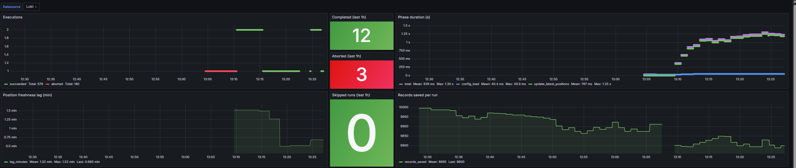

## Objetivo deste subprojeto
Disponibilizar as posições instantâneas mais recentes dos ônibus na camada refined para consumo pelo dashboard.
A implementação final é feita via a DAG updatelatestpositions do Airflow.
O desenvolvimento é feito em uma pasta dag-dev que contem cada um dos subprojetos implementados via Airflow, aumentando a agilidade durante a experimentação.
As configurações são carregadas de forma automática via `pipeline_configurator`, de acordo com o ambiente de execução, seja produção (Airflow) ou desenvolvimento local.

## O que este subprojeto faz
- Lê as posições instantâneas mais recentes armazenadas na camada trusted do serviço de object storage
- Avalia a freshness dos dados lidos em relação ao momento atual, emitindo eventos de observabilidade com o lag observado
- Salva os dados na camada refined implementada no banco de dados analítico de baixa latência, para consumo da camada de visualização

### Avaliação de freshness
Após a leitura das posições, o pipeline avalia o tempo decorrido desde o timestamp mais recente dos veículos até o momento atual (horário de São Paulo).

- Se o lag observado superar o limiar de warning (`freshness_warn_staleness_minutes`), um evento de observabilidade é emitido com nível de alerta
- Se o lag superar o limiar de falha (`freshness_fail_staleness_minutes`), o alerta do Loki é disparado
- O evento emitido é `freshness_evaluation` e carrega `observed_lag_minutes`, `warn_threshold_minutes` e `fail_threshold_minutes`
- Os limiares são configuráveis via `general.quality` no arquivo de configuração

## Pré-requisitos
- Disponibilidade do buckets da camada trusted, previamente criado no serviço de object storage
- Criação de uma chave de acesso ao serviço de object storage cadastrada no arquivo de configurações com acesso de leitura ao bucket na camada trusted
- Disponibilidade do serviço de banco de dados analítico, atualmente o PostgreSQL, para armazenamento dos dados na camada refined
- Arquivo `.env` com as credenciais necessárias
- Um template está disponível em `.env.example`
- Criação do arquivo de configurações

## Configurações
As configurações são centralizadas no módulo `pipeline_configurator` e expostas como um objeto canônico com:
- `general`
- `connections`

### Local/dev
- `general` vem do arquivo `dags-dev/updatelatestpositions/config/updatelatestpositions_general.json`
- `.env` em `dags-dev/updatelatestpositions/.env` é usado apenas para credenciais de conexão

Credenciais esperadas no `.env`:
MINIO_ENDPOINT=<hostname:port>
ACCESS_KEY=<key>
SECRET_KEY=<secret>
DB_HOST=<db_hostname>
DB_PORT=<PORT>
DB_DATABASE=<dbname>
DB_USER=<user>
DB_PASSWORD=<password>
DB_SSLMODE="prefer"

Chaves esperadas em `general`
```json
{
  "storage": {
    "trusted_bucket": "trusted",
    "app_folder": "sptrans"
  },
  "tables": {
    "positions_table_name": "positions",
    "latest_positions_table_name": "refined.latest_positions"
  },
  "quality": {
    "freshness_warn_staleness_minutes": 10,
    "freshness_fail_staleness_minutes": 30
  }
}
```

### Métricas de execução por fase
- A DAG emite um evento estruturado `execution_phase_metrics` ao final da execução.
- O evento inclui `execution_id`, `overall_status`, `total_duration_seconds` e `phase_metrics`.
- Fases rastreadas:
  - `config_load`
  - `update_latest_positions`
- Em falhas, o evento é emitido com `overall_status="failed"` antes da exceção final.

### Taxonomia de eventos
Todos os eventos seguem o padrão de logging estruturado e são consultáveis no Loki via `event="<nome>"`.

**Eventos do orquestrador:**

| Evento | Descrição |
|---|---|
| `execution_started` | Início da execução da DAG |
| `config_load_started` | Início do carregamento de configurações |
| `config_load_succeeded` | Configurações carregadas com sucesso |
| `execution_phase_metrics` | Métricas de duração por fase ao final da execução |
| `execution_finished` | Execução concluída com sucesso |
| `execution_aborted` | Execução abortada por falha |

**Eventos do serviço:**

| Evento | Descrição |
|---|---|
| `path_discovery_started` | Início da busca pelo arquivo parquet mais recente |
| `path_discovery_succeeded` | Caminho encontrado com sucesso |
| `path_discovery_empty` | Nenhum arquivo encontrado na janela de 2 horas |
| `path_discovery_failed` | Falha na busca do caminho |
| `prefix_scan_started` | Início do scan de prefixos no object storage |
| `positions_update_skipped` | Atualização ignorada por ausência de dados recentes |
| `positions_query_started` | Início da consulta ao parquet via DuckDB |
| `positions_query_succeeded` | Consulta concluída com sucesso |
| `freshness_evaluation` | Avaliação de freshness dos dados lidos |
| `positions_save_started` | Início da persistência na camada refined |
| `positions_save_succeeded` | Dados persistidos com sucesso |
| `positions_update_failed` | Falha na atualização das posições |

### Alertas Loki
As regras de alerta estão definidas em `observability/loki/rules/fake/updatelatestpositions-alerts.yaml`.

| Alerta | Severidade | Condição |
|---|---|---|
| `ExecutionAborted` | critical | Qualquer execução abortada nos últimos 5 min |
| `NoPipelineExecutionCompleted` | critical | Nenhum `execution_finished` nos últimos 10 min |
| `PositionFreshnessHigh` | warning | `observed_lag_minutes` acima de 10 min nos últimos 10 min |

### Dashboard Grafana
O dashboard está disponível em `observability/grafana/provisioning/dashboards/updatelatestpositions.json` e é provisionado automaticamente pelo Grafana.



## Instruções para instalação
Para instalar os requisitos:
- cd dags-dev
- python3 -m venv .env
- source .venv/bin/activate
- pip install -r requirements.txt

## Configurações de Banco de dados que devem ser feitas antes da execução:
Antes da execução desta pipeline, a tabela `refined.latest_positions` deve existir no banco `sptrans_insights`.

O caminho operacional recomendado para criação dos artefatos de banco necessários é executar o bootstrap PostgreSQL do projeto:

```bash
./automation/bootstrap_postgres.sh
```

Esse script aplica os arquivos SQL localizados em `/database/bootstrap/postgres/`.

### Schema de referência da tabela `refined.latest_positions`

O comando abaixo é mantido como referência documental da estrutura esperada da tabela:

```sql
CREATE TABLE refined.latest_positions (
    id BIGSERIAL PRIMARY KEY,
    veiculo_ts TIMESTAMPTZ,        -- ta: Timestamp UTC
    veiculo_id INTEGER,            -- p: id do veiculo
    veiculo_lat DOUBLE PRECISION,  -- py: Latitude
    veiculo_long DOUBLE PRECISION,  -- px: Longitude
    linha_lt TEXT,                 -- c: Letreiro completo
    linha_sentido INTEGER,         -- sl: Sentido
    trip_id TEXT
);
```

### Airflow (produção)
No Airflow, as configurações e credenciais são gerenciadas utilzando-se os recursos de Variables e Connections que são armazenadas pelo próprio Airflow, conforme listado a seguir. Qualquer alteração nessas informações deve ser feitas via UI do Airflow ou via linha de comando conectando-se ao webserver do Airflow via comando docker exec.
- Variable `updatelatestpositions_general` (JSON) — importada de `airflow/variables_and_connections/updatelatestpositions_general.json`
- Credenciais via Connections (MinIO e Postgres)

Antes da execução da DAG no Airflow, a tabela `refined.latest_positions` já deve estar criada conforme instruções acima.

## Instruções para execução em modo local
Crie `dags-dev/updatelatestpositions/.env` com base em `.env.example` preenchendo todos os campos:
Com a tabela já criada conforme instruções acima, execute:

```shell
python ./updatelatestpositions-v<version number>.py
```

Exemplo: 
```shell
python ./updatelatestpositions-v4.py
```
