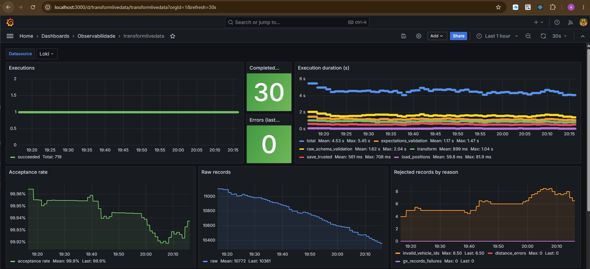

## Objetivo deste subprojeto
Fazer a transformação dos dados extraídos de posição dos ôibus da API da SPTrans, já disponibilizados na camada raw pelo microserviço extractloadlivedata, enriquecendo-os com os dados obtidos do GTFS da SPTrans, extraidos e transformados pelo processo gtfs.
A implementação final é feita via a DAG transformlivedata do Airflow.
O desenvolvimento é feito em uma pasta dag-dev que contem cada um dos subprojetos implementados via Airflow, aumentando a agilidade durante a experimentação.
As configurações são carregadas de forma automática via `pipeline_configurator`, de acordo com o ambiente de execução, seja produção (Airflow) ou desenvolvimento local.


## O que este subprojeto faz
- lê um arquivo JSON com as posicoes instantâneas dos onibus fornecidos pela sptrans armazenado no bucket da camada raw no serviço de object storage particionados por ano, mes e dia
- valida o JSON bruto com um schema configurável em arquivo JSON
- transforma os dados em uma big table consolidada em memória enriquecendo-os com dados da tabela de detalhes das viagens gerada pelo subprocesso gtfs
- salva os dados de posição instantânea transformados e enriquecidos, da tabela em memória para uma pasta (prefixo) sptrans no bucket da camada trusted no serviço de object storage, particionados por ano, mes, dia e hora para acelerar a busca e filtragem por timestamp de extração das posições instantâneas dos ônibus
- valida o resultado transformado com Great Expectations a partir de uma suite configurada externamente em um arquivo JSON
- cria quarentena para registros inválidos em um bucket com particionamento igual à da camada trusted e enriquecido com o motivo da quarentena de cada registro
- gera e salva um relatório de qualidade com contagens de registros, métricas de transformação, issues detectadas e resumo de expectativas (sucessos, violações e exceções) em um bucket de metadados
- inclui no relatório de qualidade a lineage das colunas, que é gerada automaticamente com base no schema JSON utilizado na validação do dado bruto, mapeando os caminhos do JSON para as colunas transformadas e adiciona ao lineage as colunas de cada passo da transformação.

## Relatório de qualidade e observabilidade
O pipeline gera um relatório de qualidade em formato JSON no bucket de metadados. Esse relatório possui duas seções:
- `summary`: bloco enxuto para observabilidade (status, falhas, taxa de aceitação e contagens resumidas)
- `details`: corpo completo com métricas, issues, validações e artefatos

### Validações orientadas a configuração
O processo de validação é orientado a configuração, não a código:
- JSON Schema: (validação do dado bruto) definido em `dags-dev/transformlivedata/config/transformlivedata_raw_data_json_schema.json`
- Great Expectations (validação pós-transformação) definido em `dags-dev/transformlivedata/config/transformlivedata_data_expectations.json`

Isso permite atualizar regras sem alterar o código e facilita o reuso das validações em outros projetos e pipelines.

### Métricas de transformação
O relatório inclui métricas geradas durante a transformação:
- total de veículos processados, válidos e inválidos
- total de linhas processadas
- issues detectadas (ex.: veículos inválidos, viagens inválidas, erros de cálculo de distância)

### Validação com Great Expectations (GX)
Após a transformação, a tabela é validada com uma suite GX:
- violações e exceções são registradas
- linhas inválidas são isoladas e reportadas
- **Validação Ativa de Desvio de Esquema (Schema Drift):** A suite de validação atua como um gate ativo para desvios de esquema. A expectativa `expect_table_columns_to_match_set` verifica se as colunas de saída correspondem exatamente ao conjunto declarado, detectando adições/remoções de colunas, enquanto `expect_column_values_to_be_of_type` detecta alterações de tipos de dados em colunas críticas. Divergências resultam em falhas de validação, enviando os registros para a quarentena, registrando o drift no relatório de qualidade e gerando alertas/warnings no Loki Ruler.

### Quarentena
Registros inválidos oriundos do processo de transformação ou de validação pelo Great Expecttaions são salvos na camada de quarentena.
O relatório também indica se a persistência da quarentena foi bem sucedida.

### Resumo (summary)
O bloco `summary` traz um diagnóstico rápido para monitoramento:
- `status` (`PASS` | `WARN` | `FAIL`)
- `failure_phase` e `failure_message` quando há erro
- `rows_failed` = inválidos da transformação + falhas do GX
- `acceptance_rate` = `(raw_records - rows_failed) / raw_records`

Em caso de falha que interrompa o pipeline, o relatório ainda é gerado com informações parciais das etapas concluídas até o ponto de erro.  
Isso permite identificar exatamente em qual fase o processamento parou e quais métricas já haviam sido calculadas, mesmo quando o pipeline não completa o fluxo inteiro.

- Na pasta [samples](./samples) há um exemplo curado manualmente do relatório consolidado de qualidade: [quality-report-positions_HHMM_uuid.json](./samples/quality-report-positions_HHMM_uuid.json).

### Estrutura simplificada (exemplo)
```json
{
  "summary": {
    "status": "WARN",
    "rows_failed": 9,
    "acceptance_rate": 0.999,
    "failure_phase": null
  },
  "details": {
    "transformation_row_counts": { ... },
    "transformation_metrics": { ... },
    "transformation_issues": { ... },
    "expectations_summary": { ... },
    "artifacts": { ... }
  }
}
```

### Observabilidade (stack Loki + Grafana + Alertmanager)

A observabilidade deste pipeline é baseada em logging estruturado: todos os eventos são emitidos em JSON com os campos `service`, `event`, `status`, `execution_id` e `correlation_id`. No ambiente com Airflow, os logs são coletados pelo Promtail e enviados ao Loki. Logs de bibliotecas de terceiros são roteados para o mesmo formato via bridge de observabilidade.

#### Taxonomia de eventos

Cada fase do pipeline emite eventos de ciclo de vida (`_started`, `_succeeded`, `_failed`). Quatro eventos consolidados são emitidos ao final de cada execução:

| Evento | Quando | Conteúdo relevante |
|---|---|---|
| `execution_finished` | Execução concluída com sucesso | `execution_id`, `correlation_id`, `status` |
| `execution_aborted` | Qualquer fase falha e interrompe o pipeline | `execution_id`, `correlation_id`, `status`, `message`, `metadata.phase` |
| `execution_phase_metrics` | Ao final de toda execução (sucesso ou falha) | Duração e status de cada fase em `metadata.phase_metrics` |
| `quality_report_metrics` | Após geração do relatório de qualidade | Contagens, métricas de transformação, issues e resumo GX em `metadata` |

#### Dashboard Grafana

O dashboard está em [`observability/grafana/provisioning/dashboards/transformlivedata.json`](../../../../observability/grafana/provisioning/dashboards/transformlivedata.json) e é provisionado automaticamente pelo Grafana. Utiliza Loki como datasource. Todas as queries seguem o padrão:

```
{service="airflow_tasks"} | json | service_extracted="transformlivedata" | event="<evento>"
```



O dashboard está organizado em três linhas:

**Linha 1 — Saúde operacional**

| Painel | Tipo | O que mostra | Evento Loki / campo |
|---|---|---|---|
| Executions | Timeseries (pontos) | Execuções concluídas (verde) e com falha (vermelho) ao longo do tempo | `execution_finished` e `execution_aborted` — `count_over_time [2m]` |
| Completed (last 1h) | Stat | Total de execuções bem-sucedidas na última hora | `execution_finished` — `count_over_time [1h]` |
| Errors (last 1h) | Stat (vermelho se ≥ 1) | Total de execuções com falha na última hora | `execution_aborted` — `count_over_time [1h]` |
| Execution duration (s) | Timeseries | Duração média por fase: `total`, `load_positions`, `raw_schema_validation`, `transform`, `expectations_validation`, `save_trusted` | `execution_phase_metrics` — `metadata.phase_metrics.<fase>.duration_seconds` via `avg_over_time [5m]` |

**Linha 2 — Qualidade dos dados**

| Painel | Tipo | O que mostra | Evento Loki / campo |
|---|---|---|---|
| Acceptance rate | Timeseries | Taxa de aceitação (`accepted / raw`); limiar visual em 0,98 (laranja abaixo, verde acima) | `quality_report_metrics` — `metadata.record_counts.accepted_records` / `raw_input_records` |
| Raw records | Timeseries | Volume de registros brutos recebidos por execução | `quality_report_metrics` — `metadata.record_counts.raw_input_records` |
| Rejected records by reason | Timeseries | Quebra dos registros rejeitados por motivo: IDs de veículo inválidos, erros de cálculo de distância e falhas GX | `quality_report_metrics` — `metadata.transformation_processing_issues.invalid_vehicle_ids_count`, `distance_calculation_errors_count`; `metadata.post_transformation_validation_summary.gx_records_failures` |

O campo `gx_records_failures` captura exclusivamente as linhas rejeitadas pelo Great Expectations após a fase de transformação — distinto do total de rejeitados, que inclui também os filtrados na transformação.

**Linha 3 — Logs**

| Painel | O que mostra |
|---|---|
| Recent failures | Stream filtrado dos eventos `execution_aborted` com detalhes da falha |
| Log stream | Todos os eventos do pipeline em ordem decrescente |

#### Regras de alerta

As regras estão em `observability/loki/rules/fake/transformlivedata-alerts.yaml` e são avaliadas a cada minuto pelo Loki Ruler:

| Alerta | Severidade | Condição | Janela |
|---|---|---|---|
| `PipelinePhaseFailed` | critical | Qualquer evento `execution_aborted` detectado | 5m |
| `AcceptanceRateBelowThreshold` | warning | Taxa de aceitação (`accepted / raw`) abaixo de 0,98 | 10m |
| `NoPipelineExecutionCompleted` | critical | Nenhum `execution_finished` detectado (`absent_over_time`) | 30m |

O Alertmanager (`observability/alertmanager/alertmanager.yml`) roteia:
- `critical` → entrega imediata, sem agrupamento, repetição a cada 30 min
- `warning` → agrupamento de 2 min, repetição a cada 12h

## Pré-requisitos
- Disponibilidade de quatro buckets: para a camada raw, para a camada trusted, para os registros em quarentena e para os relatórios de qualidade, previamente criados no serviço de object storage
- Criação de uma chave de acesso ao serviço de object storage cadastrada no arquivo de configurações com acesso de leitura ao bucket da camada raw e leitura e escrita na camada trusted
- Arquivo `.env` com as credenciais necessárias
- Um template está disponível em `.env.example`
- Criação do arquivo de configurações

## Configurações
As configurações são centralizadas no módulo `pipeline_configurator` e expostas como um objeto canônico com:
- `general`
- `connections`
- `raw_data_json_schema` (carregado automaticamente via `data_validations`)
- `data_expectations` (carregado automaticamente via `data_validations`)

### Local/dev
- `general` vem do arquivo `dags-dev/transformlivedata/config/transformlivedata_general.json`
- `raw_data_json_schema` vem de `dags-dev/transformlivedata/config/transformlivedata_raw_data_json_schema.json`
- `data_expectations` vem de `dags-dev/transformlivedata/config/transformlivedata_data_expectations.json`
- os artefatos acima são carregados automaticamente pelo `pipeline_configurator` com base na seção `data_validations` do `general`
- `.env` em `dags-dev/transformlivedata/.env` é usado apenas para credenciais de conexão

Credenciais esperadas no `.env` quando em modo local/dev:
MINIO_ENDPOINT=<hostname:port>
ACCESS_KEY=<key>
SECRET_KEY=<secret>
DB_HOST=<db_hostname>
DB_PORT=<PORT>
DB_DATABASE=<dbname>
DB_USER=<user>
DB_PASSWORD=<password>
DB_SSLMODE="prefer"

Chaves esperadas em `general`
```json
{
  "storage": {
    "raw_bucket": "raw",
    "trusted_bucket": "trusted",
    "quarantined_bucket": "quarantined",
    "metadata_bucket": "metadata",
    "app_folder": "sptrans",
    "gtfs_folder": "gtfs",
    "quality_report_folder": "quality-reports"
  },
  "tables": {
    "positions_table_name": "positions",
    "trip_details_table_name": "trip_details",
    "raw_events_table_name": "to_be_processed.raw"
  },
  "compression": {
    "raw_data_compression": true,
    "raw_data_compression_extension": ".zst"
  },
  "data_validations": {
    "json_validation": {
      "schemas": ["raw_data_json_schema"]
    },
    "expectations_validation": {
      "expectations_suites": ["data_expectations"]
    }
  }
}
```

## Testes unitários
Os testes deste subprojeto cobrem a lógica de transformação, o serviço de relatório de qualidade e a orquestração completa do pipeline.


## Instruções para instalação
Para instalar os requisitos:
- cd dags-dev
- python3 -m venv .venv
- source .venv/bin/activate
- pip install -r requirements.txt

## Configurações de Banco de dados que devem ser feitas antes da execução:
A tabela `to_be_processed.raw` deve existir no banco `sptrans_insights` antes da execução desta pipeline.

O caminho operacional recomendado para criação desse artefato de banco é executar o bootstrap do PostgreSQL do Airflow:

```bash
./automation/bootstrap_airflow_postgres.sh
```

Esse script aplica os arquivos SQL localizados em `/database/bootstrap/airflow_postgres/`.

### Airflow (produção)
No Airflow, as configurações e credenciais são gerenciadas utilzando-se os recursos de Variables e Connections que são armazenadas pelo próprio Airflow, conforme listado a seguir. Qualquer alteração nessas informações deve ser feitas via UI do Airflow ou via linha de comando conectando-se ao webserver do Airflow via comando docker exec.
- Variable `transformlivedata_general` (JSON, inclui a seção `data_validations`)
- Variable `transformlivedata_raw_data_json_schema` (JSON)
- Variable `transformlivedata_data_expectations` (JSON)
- Credenciais via Connections (MinIO e Postgres)

Antes da execução da DAG no Airflow, a tabela `to_be_processed.raw` já deve estar criada conforme instruções acima.
A partir da versão `transformlivedata-v10.py`, a task de transformação publica o Airflow Dataset `sptrans://trusted/transformed_positions_ready` após conclusão bem sucedida.
Isso explicita a dependência de orquestração para pipelines downstream e melhora o freshness dos dados consumidos, além de reduzir a necessidade de manutenção de agendamentos acoplados por cron.
O payload do evento carrega a chave `logical_date_string` com o timestamp UTC da execução no formato ISO 8601:
```json
{"logical_date_string": "2026-06-08T15:00:00+00:00"}
```

## Instruções para execução em modo local
Crie `dags-dev/transformlivedata/.env` com base em `.env.example` preenchendo todos os campos:
Com a tabela já criada conforme instruções acima, execute:

```shell
python transformlivedata/transformlivedata.py
```

Para reprocessamento pontual do pipeline, utilize o script [transformlivedata-backfill-v9.py](../transformlivedata-backfill-v9.py). 
Em modo local, o script percorre toda a janela entre `BACKFILL_START` e `BACKFILL_END` em passos de `BACKFILL_STEP_MINUTES` definidos no próprio script.

## Estrutura da tabela de posições instantâneas enriquecidas criadas neste subprojeto usando comando equivalente SQL:

Na pasta [samples](./samples) há um exemplo curado manualmente do artefato de saída `positions`: [positions_HHMM_0.parquet](./samples/positions_HHMM_0.parquet), apenas para referência documental.

```sql
CREATE TABLE trusted.positions (
    id BIGSERIAL PRIMARY KEY,
    extracao_ts TIMESTAMPTZ,       -- metadata.extracted_at: 
    veiculo_id INTEGER,            -- p: id do veiculo
    linha_lt TEXT,                 -- c: Letreiro completo
    linha_code INTEGER,            -- cl: Código linha
    linha_sentido INTEGER,         -- sl: Sentido
    lt_destino TEXT,               -- lt0: Destino
    lt_origem TEXT,                -- lt1: Origem
    veiculo_acessivel BOOLEAN,     -- a: Acessível
    veiculo_ts TIMESTAMPTZ,        -- ta: Timestamp UTC
    veiculo_lat DOUBLE PRECISION,  -- py: Latitude
    veiculo_long DOUBLE PRECISION,  -- px: Longitude
    is_circular BOOLEAN,
    first_stop_id INTEGER,
    first_stop_lat DOUBLE PRECISION,
    first_stop_lon DOUBLE PRECISION,
    last_stop_id INTEGER,
    last_stop_lat DOUBLE PRECISION,
    last_stop_lon DOUBLE PRECISION,
    distance_to_first_stop DOUBLE PRECISION,
    distance_to_last_stop DOUBLE PRECISION
);
```
