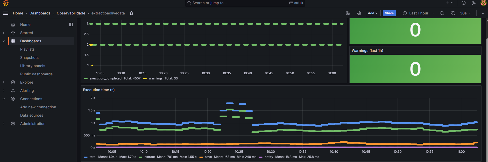

## Purpose of this subproject

Periodically extract bus position data from the SPTrans API and save it to the raw layer.
The final implementation is a microservice that runs inside a Docker container orchestrated by Docker Compose.

Because the main goal of the project is to derive information about completed trips from periodic extraction of real-time bus positions, and because this data cannot be recovered later, the robustness of this service is critical. The architecture was designed so that data can still be extracted even if object storage or the orchestrator are temporarily unavailable.

The service uses the in-process scheduler APScheduler, which provides robust scheduling with very low drift.
All extracted bus-position files are first saved to a persistent local volume managed by this microservice and only then saved to object storage. On success, the local file is removed.

To support failures and recovery, every file saved to object storage also generates a processing request for the orchestrator. Through an orchestration DAG, Airflow periodically checks whether there are pending position files to process and, when there are, triggers a transformation DAG for the corresponding raw file.

This architecture supports failures in object storage, the orchestrator, and the orchestrator database where pending processing requests are stored.
Although this is not the preferred production path for full resilience, the service can also trigger the transformation DAG directly through the Airflow API instead of creating a persisted processing request. This is configurable through an environment variable and allows switching between a persisted-queue flow and a direct-trigger flow.

## What this subproject does

- periodically extracts bus positions from the SPTrans API at a configurable interval; if failures or invalid payloads occur, the operation is retried with exponential backoff
- validates the minimum structure of the payload and records reference metrics such as source time and total number of vehicles
- builds an in-memory JSON object with `metadata` (source, timestamp, and total vehicles) and the original `payload`
- saves the JSON locally in a configured volume
- persists the JSON to MinIO in the raw layer, partitioned by date, optionally compressed with Zstandard or stored as plain JSON
- uses `metadata.extracted_at` as the single timestamp source for raw artifact naming and storage partitioning; `payload.hr` remains only as informational source reference due to drifts on this API response field value
- the [samples](./samples) folder contains manually curated examples of the raw artifact saved by the service:
  - [posicoes_onibus-YYYYMMDDHHmm.json](./samples/posicoes_onibus-YYYYMMDDHHmm.json)
  - [posicoes_onibus-YYYYMMDDHHmm.json.zst](./samples/posicoes_onibus-YYYYMMDDHHmm.json.zst)
- keeps local files pending for object-storage save when storage is unavailable, retries them in future executions, and removes the local file after successful persistence
- records a processing request in the Airflow-hosted database for each raw-layer file that must be processed by the pipeline. If request creation fails, the file remains stored locally until the operation succeeds. If Airflow is unavailable, the orchestration DAG later detects the pending requests and triggers the transformation DAG one file at a time, in creation order, preserving ordered delivery over time
- alternatively, can trigger the transformation DAG directly through the Airflow API without creating a database request, depending on configuration

## Observability: Structured Logging

The service implements production-grade observability with **structured JSON logs**, **per-phase metrics**, and **data lineage tracking** via correlation ID.

### Structured Logs
- **Format**: JSON with fields `timestamp`, `level`, `service`, `component`, `event`, `status`, `message`, `metadata`
- **Output**: stdout for Loki ingestion
- **Taxonomy**: structured events defined in [src/domain/events.py](./src/domain/events.py)
- **Status**: controlled enum (`STARTED`, `SUCCEEDED`, `FAILED`, `RETRY`, `SKIPPED`)

### Execution Tracking (execution_id)
Each execution receives an `execution_id` in **ISO 8601 format** (UTC start timestamp):
- Example: `"2026-05-13T15:30:15.987654+00:00"`
- Correlates all logs from one execution in Loki

### Per-Phase Metrics (Phase Instrumentation)
The service tracks **attempts, successes and failures** across three phases:

1. **Extract phase**
   - Attempts to extract positions from the API
   - Captures `logical_datetime` from `buses_positions["metadata"]["extracted_at"]` (data timestamp)
   - Saves locally and proceeds to the next phase

2. **Save phase**
   - Persists pending local files to MinIO
   - Each saved file is registered in the database as a processing request
   - Tracks total save duration

3. **Notify phase**
   - Triggers the transformation DAG (via Airflow or database)
   - Tracks success/failure per invocation
   - Final metrics aggregation

### Execution Metrics Final Event (execution_metrics_final)
Emitted at the end of each execution with Prometheus-compatible structure:

```json
{
  "event": "execution_metrics_final",
  "status": "SUCCEEDED",
  "execution_id": "2026-05-13T15:30:15.987654+00:00",
  "correlation_id": "2026-05-13T15:30:45.123456+00:00",
  "metadata": {
    "phase_metrics": {
      "extract": {"attempted": 1, "succeeded": 1, "failed": 0, "duration": 3.21},
      "save": {"attempted": 3, "succeeded": 2, "failed": 1, "duration": 7.89},
      "notify": {"attempted": 3, "succeeded": 3, "failed": 0, "duration": 1.35}
    },
    "items_total": 7,
    "items_failed": 1,
    "retries_seen": 4,
    "execution_seconds": 12.45
  }
}
```

### Data Lineage Tracking (Correlation ID)
Every operation is tagged with `correlation_id = logical_datetime` (data timestamp):
- Enables tracing "all processing of data extracted at 2026-05-13T15:30:45.123456Z" across all pipelines
- Enables Loki queries: `{correlation_id="2026-05-13T15:30:45.123456Z"}` to see all operations on this data
- Propagates from extractloadlivedata → transformlivedata → refinedfinishedtrips for full lineage

### Event Taxonomy

All events are emitted via `{service="extractloadlivedata"}` (direct Docker container stream).

**Scheduler** events (main.py):

| Event | When |
|---|---|
| `scheduler_config_loaded` | Configuration loaded successfully |
| `scheduler_started` | Scheduler started |
| `scheduler_tick_started` / `scheduler_tick_completed` | Start and end of each APScheduler tick |
| `scheduler_stopped` | Scheduler stopped (SIGTERM/SIGINT) |
| `scheduler_shutdown_completed` | Scheduler shutdown completed |
| `cli_dev_mode_requested` | Execution started in `dev` mode (single run) |
| `cli_invalid_parameter` | Invalid CLI parameter |

**Orchestrator** events (extractloadlivedata.py):

| Event | When | Relevant content |
|---|---|---|
| `config_validation_succeeded` / `config_validation_failed` | Configuration validation | `error_message` on failure |
| `notification_engine_selected` | Notification engine determined | `metadata.engine` |
| `execution_started` | Start of an execution | `execution_id` |
| `extract_positions_started` / `extract_positions_succeeded` | Extract phase | — |
| `pending_storage_scan_succeeded` / `pending_storage_scan_failed` | Local buffer scan | `metadata.pending_count` |
| `pending_storage_detected` / `pending_storage_multiple_files_detected` | Pending files detected | `metadata.pending_count` |
| `pending_storage_file_started` / `pending_storage_file_succeeded` / `pending_storage_file_failed` | Each pending file processed | `metadata.filename` |
| `notification_dispatch_started` / `notification_dispatch_succeeded` / `notification_dispatch_failed` | Notification dispatch | `metadata.filename` |
| `notification_metrics_invalid` | Notification metrics inconsistent | — |
| `execution_metrics_final` | At the end of every execution | `metadata.phase_metrics`, `metadata.items_total`, `metadata.items_failed`, `metadata.retries_seen`, `metadata.execution_seconds` |
| `execution_summary_emitted` | Summary sent to alertservice | — |
| `execution_completed` | Execution closed without fatal failures | `metadata.items_total`, `metadata.items_failed`, `metadata.retries_seen` |
| `execution_failed_non_recoverable` | Execution closed with non-recoverable failure | `metadata.items_failed`, `metadata.failure_phase` |

Service events — **Extraction** (extract_buses_positions.py):

| Event | When | Relevant content |
|---|---|---|
| `api_authentication_successful` / `api_authentication_failed` | SPTrans API authentication | `error_message` on failure |
| `api_get_started` / `api_get_successful` / `api_get_failed` | API GET call | `metadata.attempt` |
| `extract_positions_succeeded_after_retries` | Extraction succeeded after retries | `metadata.retries` |
| `extract_positions_failed` | Extraction failed on all attempts | `error_type`, `error_message` |
| `summarize_extracted_positions_succeeded` | Extracted positions summary produced | `metadata.total_vehicles` |
| `metadata_validation_failed` | Invalid payload structure | `metadata.payload_sample` |

Service events — **Local storage** (save_load_bus_positions.py):

| Event | When | Relevant content |
|---|---|---|
| `local_storage_persist_started` | Start of save to local volume | `metadata.filename` |
| `local_storage_compression_succeeded` | Zstandard compression completed | `metadata.filename` |
| `local_storage_persist_succeeded` | File saved to local volume | `metadata.filename` |
| `local_storage_persist_failed` | Failed to save to local volume | `metadata.filename`, `error_type` |

Service events — **Object storage** (save_load_bus_positions.py):

| Event | When | Relevant content |
|---|---|---|
| `object_storage_compression_started` / `object_storage_compression_succeeded` | Compression before upload | `metadata.filename` |
| `object_storage_persist_started` / `object_storage_persist_succeeded` / `object_storage_persist_failed` | MinIO persistence | `metadata.bucket`, `metadata.object_name` |
| `object_storage_list_failed` | Failed to list pending MinIO objects | `error_type`, `error_message` |
| `remove_pending_storage_file_succeeded` / `remove_pending_storage_file_failed` | Local file removal after upload | `metadata.filename` |

Service events — **Database** (save_processing_requests.py):

| Event | When | Relevant content |
|---|---|---|
| `db_storage_persist_started` / `db_storage_persist_succeeded` / `db_storage_persist_failed` | Processing request creation in PostgreSQL | `metadata.filename`, `metadata.table` |

Service events — **Airflow API trigger** (trigger_airflow.py):

| Event | When | Relevant content |
|---|---|---|
| `get_utc_logical_date_succeeded` / `get_utc_logical_date_failed` | UTC logical date calculation | `metadata.logical_date` |

### Grafana Dashboard

The dashboard is at [`observability/grafana/provisioning/dashboards/extractloadlivedata.json`](./observability/grafana/provisioning/dashboards/extractloadlivedata.json) and is provisioned automatically by Grafana. It uses Loki as the datasource. All queries use the stream `{service="extractloadlivedata"}`.

Default window: `now-1h`. Refresh: `30s`.



| Panel | Type | What it shows | Loki event / field |
|---|---|---|---|
| Executions | Timeseries (dots) | `execution_completed` (green), `execution_failed_non_recoverable` (red), errors and warnings over time | `execution_completed`, `execution_failed_non_recoverable`, level `ERROR`, level `WARNING` — `count_over_time [5m]` |
| Errors (last 1h) | Stat (red if ≥ 1) | Total logs with `level="ERROR"` in the last hour | `count_over_time [1h]` |
| Warnings (last 1h) | Stat (orange if ≥ 1) | Total logs with `level="WARNING"` in the last hour | `count_over_time [1h]` |
| Execution time (s) | Timeseries | Average duration per phase: `total`, `extract`, `save`, `notify` | `execution_metrics_final` — `metadata.execution_seconds` and `metadata.phase_durations.<phase>` via `avg_over_time [5m]` |
| Recent failures | Logs | Stream filtered by `level="ERROR"` in descending order | — |
| Log stream | Logs | All service events in descending order | — |

### Alert Rules

Rules are defined in `observability/loki/rules/fake/extractloadlivedata-alerts.yaml` and evaluated every minute:

| Alert | Severity | Condition | Window |
|---|---|---|---|
| `ServiceFailed` | critical | `execution_failed_non_recoverable` event detected | 5m |
| `ServiceWarningThreshold` | warning | `execution_completed` with `metadata.retries_seen > 0` | 5m |

## Execution reporting (`alertservice`)

- Scope: the service publishes **only an execution summary** to `alertservice`; no JSON report artifact is persisted
- Summary contract sent:
  - `contract_version`, `pipeline`, `execution_id`, `status`
  - `items_total`, `items_failed`, `retries`, `acceptance_rate`
  - `generated_at_utc` (UTC timestamp when the summary is generated)
  - `failure_phase`, `failure_message` (only for `FAIL`)
  - `quality_report_path` with value `"null"` for contract compatibility
- Execution status enum:
  - `PASS`: no failures and zero retries
  - `WARN`: no failures but retries were detected
  - `FAIL`: one or more phases failed
- Failure phase enum (orchestration):
  - `positions_download`
  - `local_ingest_buffer_save_positions`
  - `save_positions_to_raw`
  - `ingest_notification`
  - fallback: `unknown`
- Fixed failure messages per phase:
  - `positions_download`: `[SEVERE] non recoverable api get failed`
  - `local_ingest_buffer_save_positions`: `[SEVERE] non recoverable save to local buffer failed`
  - `save_positions_to_raw`: `save to raw storage failed`
  - `ingest_notification`: `ingest notification failed`
  - `unknown`: `ingest execution failed`
- Severity rule: only `positions_download` and `local_ingest_buffer_save_positions` receive the `[SEVERE] non recoverable ` prefix
- Webhook rule:
  - missing webhook or `disabled` / `none` / `null` -> send is skipped with an info log
  - send failure does not interrupt the service and is logged as an error

## Prerequisites

- object storage service available to save data extracted from the SPTrans API
- `.env` file with the required configuration
- a template is available in `.env.example`
- database schema and table created to store processing requests for extracted bus-position files

The recommended operational path to create these database artifacts is to run the project's Airflow PostgreSQL bootstrap:

```bash
./automation/bootstrap_airflow_postgres.sh
```

This script applies the SQL files located in `/database/bootstrap/airflow_postgres/`.

### Reference schema for `to_be_processed.raw`

The block below is kept as documentation reference for the expected table structure:

```sql
CREATE SCHEMA to_be_processed;

CREATE TABLE IF NOT EXISTS to_be_processed.raw (
    id BIGSERIAL PRIMARY KEY,
    filename VARCHAR(255) NOT NULL,
    logical_date TIMESTAMPTZ NOT NULL,
    processed BOOLEAN NOT NULL DEFAULT FALSE,
    created_at TIMESTAMPTZ NOT NULL,
    updated_at TIMESTAMPTZ NOT NULL
);

CREATE INDEX IF NOT EXISTS idx_raw_processed ON to_be_processed.raw(processed);
CREATE INDEX IF NOT EXISTS idx_raw_filename ON to_be_processed.raw(filename);
CREATE INDEX IF NOT EXISTS idx_raw_logical_date ON to_be_processed.raw(logical_date);
CREATE INDEX IF NOT EXISTS idx_raw_created_at ON to_be_processed.raw(created_at);
```

## Configuration

```bash
EXTRACTION_INTERVAL_SECONDS=120
API_BASE_URL="https://api.olhovivo.sptrans.com.br/v2.1"
TOKEN=<insert the API access token obtained after registering on the SPTrans website>
API_MAX_RETRIES=4
INGEST_BUFFER_PATH="../ingest_buffer"
DATA_COMPRESSION_ON_SAVE="true"
PROCESSING_REQUESTS_CACHE_DIR="../.diskcache_pending_processing_requests"
SOURCE_BUCKET="raw"
APP_FOLDER="sptrans"
STORAGE_MAX_RETRIES=0
RAW_EVENTS_TABLE_NAME="to_be_processed.raw"
NOTIFICATION_ENGINE="processing_requests"
MINIO_ENDPOINT="localhost:9000"
ACCESS_KEY="datalake"
SECRET_KEY="datalake"
DB_HOST="localhost"
DB_PORT=5432
DB_DATABASE="sptrans_insights"
DB_USER="airflow"
DB_PASSWORD="airflow"
DB_SSLMODE="prefer"

# Legacy env variables
AIRFLOW_USER="ingest_service"
AIRFLOW_PASSWORD="ingest_password"
AIRFLOW_WEBSERVER="localhost"
AIRFLOW_DAG_NAME="transformlivedata-v5"
INVOKATIONS_CACHE_DIR="../.diskcache_pending_invocations"

NOTIFICATIONS_WEBHOOK_URL="http://localhost:8000/notify"
```

## Unit tests

Tests focus on relevant behavior and business invariants, using dependency injection and fakes without monkeypatching to isolate external integrations. Current coverage includes:
- `tests/test_extract_buses_positions.py`: payload validation, authentication, and extraction retry flow
- `tests/test_save_load_bus_positions.py`: structure validation, compression, file reading, persistence with retries, local file removal, and pending-file filtering
- `tests/test_save_processing_requests.py`: creation and triggering of processing requests with cache and database persistence
- `tests/test_trigger_airflow.py`: creation and triggering of Airflow invocations through HTTP and cache
- `tests/test_extractloadlivedata_orchestrator.py`: orchestrator routing between `processing_requests` and `airflow`, configuration validation, and orchestration tests with integrated `alertservice`
- `tests/test_alertservice.py`: payload construction, alert sending with webhook enabled/disabled, and non-blocking behavior on failures
- `tests/test_reporting.py`: execution-summary construction with validated contract for both success and failure paths
- `tests/test_sql_db_v2.py`: persistence, select, and update contracts with injected engine
- `tests/test_object_storage.py`: object storage read, list, and write behavior with injected client

## Installing requirements

- `cd <this subproject directory>`
- `python3 -m venv .venv`
- `source .venv/bin/activate`
- `pip install -r requirements.txt`

## Running

### Local

Create `extractloadlivedata/.env` based on `.env.example` and fill in all fields.

```bash
python ./main.py
```

### Build and run the container standalone

Copy `.env` to `.env-docker` and adjust hostname and port as needed.

```bash
cd ./extractloadlivedata
docker build -t sptrans-extractloadlivedata -f Dockerfile .
docker run --name extractloadlivedata sptrans-extractloadlivedata
```

To allow communication with the other containers:

```bash
docker run --name extractloadlivedata --network engenharia-dados_rede_fia sptrans-extractloadlivedata
```

### Docker Compose

To build the container:

```bash
docker compose build --no-cache extractloadlivedata
```

To start the container:

```bash
docker compose up -d extractloadlivedata
```
