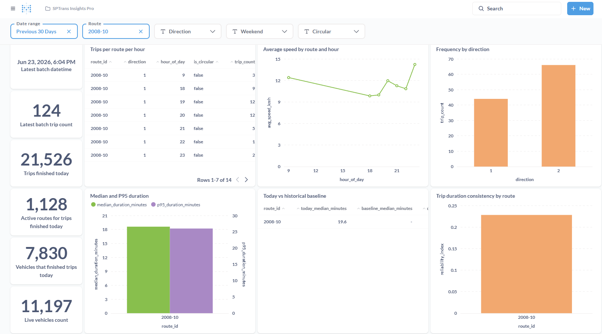
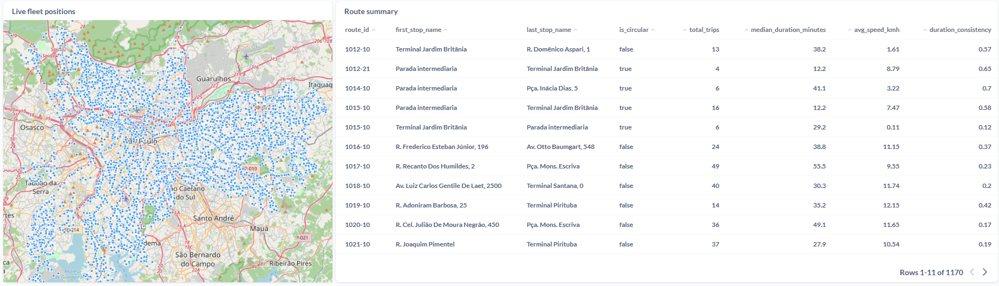

# Metabase (BI como código)

Ativos que são fonte da verdade para a plataforma de BI Metabase self-hosted (ADR-0012). O
Metabase consome a camada governada `refined` do PostgreSQL analítico (`postgres` /
`sptrans_insights`) e é o **dono das perguntas (queries) executáveis do dashboard**.

## Por que estes arquivos vivem aqui (e não no pipeline)

O ADR-0013 desacopla o **modelo analítico** (o star schema `refined.trip_facts` — um contrato
agnóstico de ferramenta, versionado na camada de dados) da **ferramenta de BI**. A metade
simétrica dessa regra: as **queries executáveis dos painéis são responsabilidade do Metabase**,
não do pipeline. Elas carregam filtros, parâmetros, seletores de rota, ordenação e lógica de
exibição que pertencem à pergunta, não ao contrato de dados.

Mantê-los aqui (em vez de dentro de `dags-dev/refinedtripfacts/`) significa:

- propriedade explícita — o pipeline é dono do modelo + uma prova de conceito; o Metabase é
  dono das perguntas;
- eles nunca são arrastados para o runtime do Airflow pelo `scripts/promote_pipeline.py` (esse
  rsync sincroniza a pasta inteira do pipeline para `airflow/dags/`); estas queries não têm
  nada a ver com o runtime das DAGs.

## Relação com o `queries/` do pipeline

`dags-dev/refinedtripfacts/queries/` contém **SQL de prova de conceito, não autoritativo e sem
filtros**, que provou que o modelo dimensional consegue responder a todos os painéis. Os
arquivos aqui são as perguntas nativas **autoritativas**: adicionam os field filters do
Metabase, as variáveis e as estatísticas exatas que os painéis exigem. Estes arquivos são a
implementação autoritativa dos painéis; os arquivos de PoC não são editados para acompanhar o
dashboard.

## `dashboard_queries/` → mapa de painéis

| Arquivo | Painel(éis) | Âncora (lógica de data) |
| --- | --- | --- |
| `latest_batch_freshness.sql`                  | P0          | `logic_date` (apenas freshness operacional) |
| `today_kpis.sql`                              | P1, P2, P3  | **conclusão** da viagem (`ended_at_time_dim_key`), fixado em `current_date` |
| `frequency_by_route_hour_direction.sql`       | P4, P5      | **início** da viagem (`started_at_time_dim_key`) |
| `median_and_p95_duration_by_route.sql`        | P6          | **início** da viagem |
| `duration_today_vs_same_weekday_baseline.sql` | P7          | **início** da viagem, janela fixa de 4 semanas do mesmo dia da semana |
| `reliability_by_route.sql`                    | P8          | **início** da viagem |
| `avg_speed_by_route_and_hour.sql`             | P9          | **início** da viagem |
| `route_summary_with_trip_details.sql`         | P10         | **início** da viagem, faz join com `trip_details` por `trip_id` |
| `live_fleet_positions.sql`                    | P11         | snapshot ao vivo de veículos; mapa por `veiculo_lat`/`veiculo_long` |
| `live_fleet_positions_freshness.sql`          | P11         | snapshot ao vivo; card companheiro com contagem de veículos e freshness |

> **P11 — painel de `refined.latest_positions`.** O painel de posição da frota ao vivo lê
> `refined.latest_positions`; as implementações autoritativas das perguntas vivem em
> `metabase/dashboard_queries/live_fleet_positions.sql` e
> `metabase/dashboard_queries/live_fleet_positions_freshness.sql`.

## Notas de configuração das perguntas nativas

- **Field filters** (`[[ AND {{var}} ]]`) exigem **nomes de tabela totalmente qualificados**
  (sem aliases) para serem resolvidos — as queries aqui são escritas dessa forma de propósito.
- Parâmetros padrão entre os painéis: `date_range` (Field Filter em
  `refined.dim_time.date_actual`, padrão *Previous 30 days*), `route`, `direction`,
  `is_weekend`, `is_circular` e um número `min_trips` para guarda de baixa amostragem (padrão
  `5`). O comentário no cabeçalho de cada arquivo lista os mapeamentos exatos que ele espera.
- O datasource read-only `sptrans_insights` (com escopo no schema `refined`) e o timezone são
  **provisionados automaticamente** por `automation/bootstrap_metabase.sh` — não exigem
  configuração manual. O timezone de sessão do role de leitura é definido como `America/Sao_Paulo`,
  então o `current_date` do SQL nativo — e os painéis de "hoje" (P1–P3, P7) — ficam ancorados no
  dia local de São Paulo, e não em UTC; o **Report Timezone** do Metabase (também
  `America/Sao_Paulo`) controla a exibição de timestamps.

## Dashboard SPTrans Insights

O dashboard `SPTrans Insights` é provisionado automaticamente por `automation/bootstrap_metabase_dashboard.sh` — nenhum passo manual de UI é necessário, exceto o auto-refresh descrito abaixo.

### Layout

O dashboard usa a grade de 24 colunas do Metabase e é composto por 14 cards organizados em 4 regiões:

| Região | Cards | Descrição |
|---|---|---|
| Coluna esquerda (KPIs) | P0A, P0B, P1, P2, P3, P11B | Escalares empilhados verticalmente |
| Linha de conteúdo 1 | P4, P9, P5 | Frequência por rota/hora, velocidade, frequência por direção |
| Linha de conteúdo 2 | P6, P7, P8 | Duração mediana/P95, comparativo histórico, consistência de duração |
| Linha do mapa | P11A, P10 | Mapa de posições ao vivo + tabela resumo de rotas |

### Filtros globais

5 filtros disponíveis na barra do dashboard:

| Filtro | Tipo | Cards afetados |
|---|---|---|
| Date range | `date/all-options` (padrão: últimos 30 dias) | P4, P5, P6, P8, P9, P10 |
| Route | `string/=` | P4, P5, P6, P7, P8, P9, P10 |
| Direction | `string/=` | P5, P6 |
| Weekend | `category` | P4, P5, P6 |
| Circular | `category` | P4, P5, P6, P8, P9, P10 |

P0A, P0B, P1, P2, P3 e P7 têm janelas fixas e não são afetados pelos filtros globais. P11A e P11B possuem filtros locais de painel (`linha_lt`, `linha_sentido`) não expostos na barra global.

### Capturas de tela

**Metade superior — filtros, KPIs e painéis analíticos**

A captura mostra o dashboard filtrado pela rota `2008-10` nos últimos 30 dias. Na barra de filtros estão ativos **Date range** (Previous 30 Days) e **Route** (2008-10); os filtros Direction, Weekend e Circular estão disponíveis mas sem seleção.

A coluna esquerda exibe os KPIs operacionais em tempo real: data/hora do último batch (`Jun 23, 2026, 6:04 PM`), volume do último batch (`124` viagens), total de viagens concluídas no dia (`21.526`), rotas ativas (`1.128`), veículos que finalizaram viagens no dia (`7.830`) e contagem de veículos ao vivo (`11.197`).

A linha de conteúdo 1 contém: a tabela **Trips per route per hour** (14 linhas para direção 1, horas 9–23), o gráfico de linhas **Average speed by route and hour** (velocidade entre 9 e 14 km/h ao longo do dia) e o gráfico de barras **Frequency by direction** (direção 1 ≈ 44 viagens, direção 2 ≈ 66 viagens).

A linha de conteúdo 2 exibe: **Median and P95 duration** (mediana ≈ 18 min, P95 ≈ 28 min para a rota 2008-10), **Today vs historical baseline** (mediana do dia = 19,6 min; baseline ausente — sem dados de mesmo dia da semana nas 4 semanas anteriores) e **Trip duration consistency by route** (índice de consistência ≈ 0,21 — coeficiente de variação da duração das viagens).

---

**Metade inferior — mapa ao vivo e resumo de rotas**

À esquerda, o mapa **Live fleet positions** exibe a distribuição dos veículos em operação em tempo real sobre o mapa de São Paulo, com pins azuis concentrados nas regiões de maior densidade de linhas.

À direita, a tabela **Route summary** detalha, por rota e sentido, os terminais de origem e destino (`first_stop_name`, `last_stop_name`), o indicador `is_circular`, o total de viagens do período (`total_trips`), a duração mediana em minutos (`median_duration_minutes`), a velocidade média (`avg_speed_kmh`) e a consistência de duração (`duration_consistency`). A tabela exibe as primeiras 11 de 177 linhas para o período selecionado.

---

### Auto-refresh (passo manual único)

O auto-refresh não pode ser definido via API no Metabase v0.52.9. Após o provisionamento, configurar uma única vez na UI:

1. Abrir o dashboard `SPTrans Insights`
2. Clicar no ícone de relógio/atualização no canto superior direito
3. Selecionar **1 minuto**

> Após rodar `bootstrap_metabase_dashboard.sh`, fazer logout e login no Metabase — um simples refresh de página não reflete a nova configuração.

## Relacionados

- ADR-0012 — Migração do Power BI para o Metabase self-hosted
- ADR-0013 — Modelo dimensional `refinedtripfacts` (desacoplamento do modelo em relação à ferramenta de BI)
- `automation/bootstrap_metabase.sh` — Provisionamento do Metabase + grant de leitura
- `database/bootstrap/postgres/004_metabase.sql` — Role de leitura / grants de `SELECT` em `refined`
