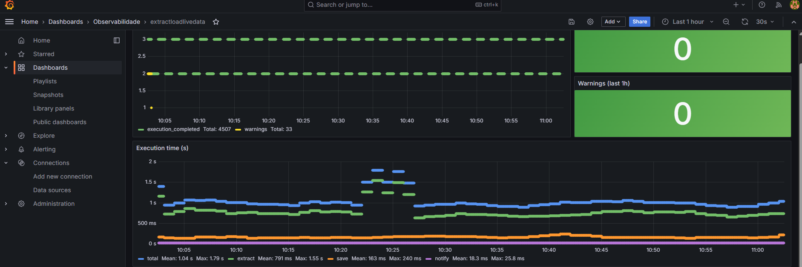

# Observability

This directory contains the configuration for the platform's centralized log observability stack, based on **Grafana + Loki + Promtail**.

Observability is treated as a cross-platform capability, not only as monitoring for a single service. The project strategy covers three complementary dimensions: log structuring, data-lineage tracking, and execution metrics instrumentation.

The strategy uses structured JSON logs as a standard contract between components. This format makes events machine-readable, simplifies parsing and automated querying, and increases consistency of operational analysis across services and pipelines.

For end-to-end traceability, the project uses `correlation_id` based on `logical_datetime` (timestamp of processed data across pipelines) and `execution_id` (execution correlation). This combination enables cross-stage auditing, faster failure diagnosis, and consistent operational monitoring of flow health.

Pipeline information flow monitored by observability:

`extractloadlivedata` → `transformlivedata` → `refinedfinishedtrips`

As an execution/metrics instrumentation reference, `extractloadlivedata` records per-phase metrics (`extract`, `save`, `notify`) with attempts, successes, failures, and duration, plus the final `execution_metrics_final` event, structured for Prometheus/AlertManager queries and per-execution operational visibility.

## Stack

| Component | Role |
|---|---|
| **Loki** | Log aggregation backend. Receives structured log streams and stores them indexed by labels. |
| **Promtail** | Log shipping agent. Scrapes container logs via the Docker socket and forwards them to Loki. |
| **Grafana** | Visualization layer. Queries Loki using LogQL and renders dashboards. |

All three services are defined in the root `docker-compose.yml` and share the `rede_fia` network.

## Architecture

```
extractloadlivedata (stdout JSON logs)
  → Docker runtime
    → Promtail (Docker socket scrape)
      → Loki (label-indexed storage)
        → Grafana (LogQL queries + dashboards)
```

The application emits structured JSON logs to `stdout`. Promtail collects them externally via the Docker socket — the application has no knowledge of the transport layer. This keeps the logging contract stable and the backend swappable per environment.

## Log Contract

Every log line is a JSON object. Mandatory fields:

| Field | Description |
|---|---|
| `timestamp` | UTC timestamp (ISO 8601) |
| `level` | `DEBUG` / `INFO` / `WARNING` / `ERROR` / `CRITICAL` |
| `service` | Service name (e.g. `extractloadlivedata`) |
| `component` | Module or class emitting the log |
| `event` | Stable snake_case event name (e.g. `execution_metrics_final`) |
| `message` | Human-readable description |

Recommended fields: `execution_id`, `correlation_id`, `status`, `metadata`.

## Loki Labels

Promtail indexes the following labels for stream selection in LogQL:

| Label | Value |
|---|---|
| `service` | `extractloadlivedata` |
| `container` | Container name |
| `source` | `docker` |

All other fields (e.g. `event`, `level`, `execution_id`) are parsed at query time using `| json`.

## Dashboards

Dashboards are provisioned automatically from `grafana/provisioning/dashboards/`. No manual import is needed.

| Dashboard | File | Description |
|---|---|---|
| extractloadlivedata | `extractloadlivedata.json` | Executions, errors, warnings, execution time per phase, log stream |

The screenshot below shows the extractloadlivedata dashboard in operation delivering the amount of errors and warnings for each execution and the execution times for each phase of the extraction workflow implemented by the service.



After editing a dashboard JSON, bump its `version` field and reload without restarting Grafana:

```bash
curl -X POST http://admin:<password>@localhost:3000/api/admin/provisioning/dashboards/reload
```

## Directory Structure

```
observability/
  loki/
    loki-config.yml          # Loki server config (filesystem storage, single-node)
  promtail/
    promtail-config.yml      # Promtail scrape config (Docker socket, extractloadlivedata filter)
  grafana/
    provisioning/
      datasources/
        loki.yml             # Auto-provisioned Loki datasource
      dashboards/
        dashboards.yml       # Dashboard provider config
        extractloadlivedata.json  # extractloadlivedata dashboard
```

## Local URLs

| Service | URL |
|---|---|
| Grafana | http://localhost:3000 |
